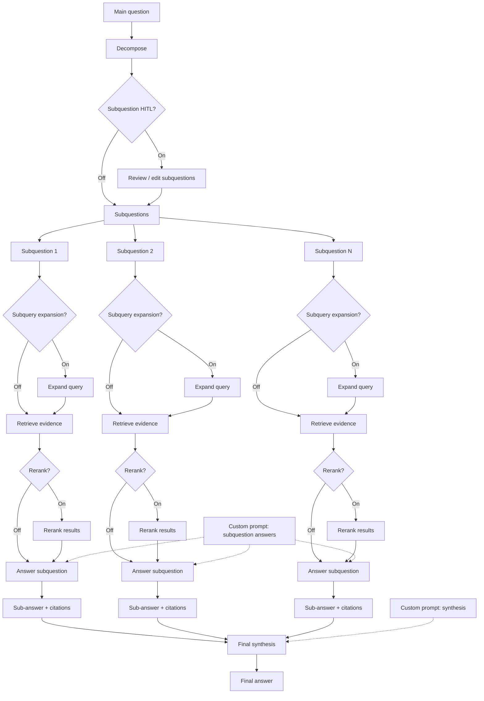

<p align="center">
  
</p>

# agent-search

`agent-search` supercharges your RAG flow by improving accuracy with our open-source framework, backed by the Onyx team’s work on agentic search with LangGraph: https://onyx.app/blog/agent-search-with-langgraph?ref=blog.langchain.com.

Onyx builds AI search and knowledge experiences for teams that need dependable, source-grounded answers. Agent-search distills those production learnings into a developer SDK so you can ship more reliable retrieval flows without rebuilding the orchestration stack from scratch.

## Documentation

The consolidated project reference is available at `docs/application-document.html`. It is the agent-search-specific HTML source of truth for architecture, concerns, conventions, integrations, stack, structure, testing, runtime flow, and key tradeoffs, including the current no-timeout-guardrails runtime behavior.

Live architecture blog (GitHub Pages): [https://nickbohm555.github.io/agent-search/architecture.html](https://nickbohm555.github.io/agent-search/architecture.html).

## Data Flow Diagram



## SDK Quick Reference (PyPI)

For the full, canonical SDK docs, see [https://pypi.org/project/agent-search-core/](https://pypi.org/project/agent-search-core/).

The PyPI package is an in-process Python SDK for `agent-search`. It is intentionally narrow: consumers should call `advanced_rag(...)` and treat that as the supported entrypoint. The SDK always requires both:

- A chat model (for example `langchain_openai.ChatOpenAI`)
- A vector store that implements `similarity_search(query, k, filter=None)`

It does not auto-build these dependencies for you.

**Install (PyPI)**

```bash
python3.11 -m venv .venv
source .venv/bin/activate
pip install --upgrade pip
pip install agent-search-core
python -c "import agent_search; print(agent_search.__file__)"
```

**Quick Start**

```python
from langchain_openai import ChatOpenAI
from agent_search import advanced_rag
from agent_search.vectorstore.langchain_adapter import LangChainVectorStoreAdapter

vector_store = LangChainVectorStoreAdapter(your_langchain_vector_store)
model = ChatOpenAI(model="gpt-4.1-mini", temperature=0.0)

response = advanced_rag(
    "What is pgvector?",
    vector_store=vector_store,
    model=model,
)
print(response.output)
```

**Included Features**

- Multi-step agentic retrieval: Breaks a main question into subquestions, runs retrieval across parallel lanes, and synthesizes a final answer from the collected evidence.
- Subquestion HITL review: Supports one optional human-in-the-loop checkpoint after decomposition so operators can review or edit subquestions before execution continues.
- Optional query expansion: Lets you turn query expansion on or off per run to broaden retrieval coverage when the question benefits from wider search terms.
- Optional reranking: Lets you turn reranking on or off per run to reorder retrieved evidence before subanswers are generated.
- Checkpointed resume flows: Supports resumable HITL runs through checkpoint persistence so paused work can continue without restarting the full graph.
- Flexible checkpoint ownership: Works with either an SDK-managed `checkpoint_db_url` or an injected `checkpointer`, depending on whether you want the SDK or your app to own checkpoint storage.
- Runtime controls via config: Exposes `runtime_config` and related config controls so callers can adjust runtime behavior without changing application code.
- Prompt overrides: Exposes `custom_prompts.subanswer` and `custom_prompts.synthesis` so teams can customize answer-generation behavior while preserving runtime-supplied question and evidence inputs.
- SDK-friendly pause/resume contract: Returns a normalized `review` object on pauses and uses SDK-owned resume helpers instead of requiring callers to construct raw backend payloads.
- Callback integration: Accepts LangChain-compatible callbacks so application telemetry or orchestration hooks can observe the run lifecycle.

For broader runtime and prompt behavior details, see `docs/application-document.html`.

**Example Flow**

Screenshot of the end-to-end flow with subquestion review, optional query expansion and reranking, and final synthesis.


