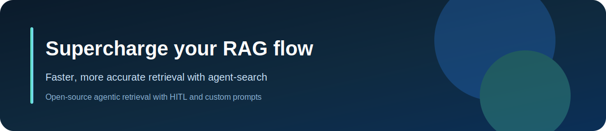
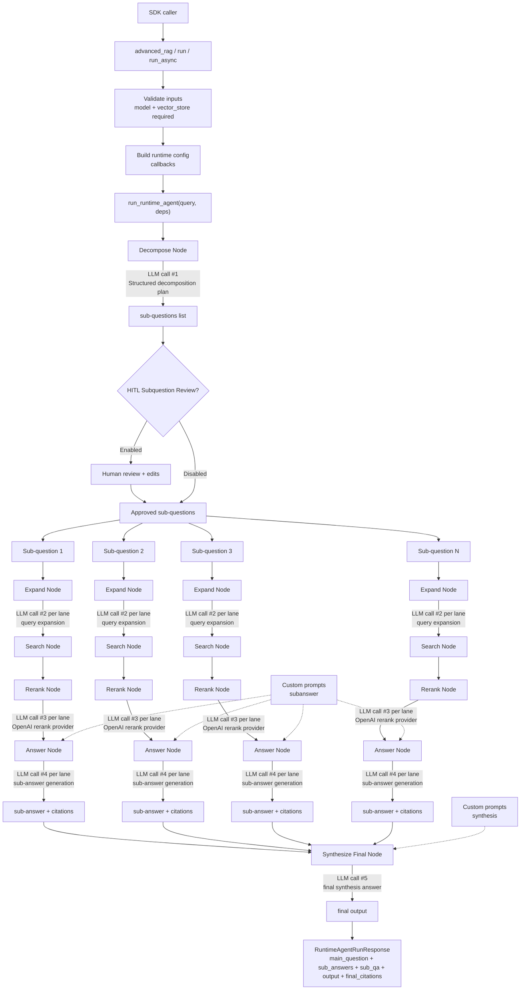

<p align="center">
  
</p>

# agent-search

`agent-search` supercharges your RAG flow by improving accuracy with our open-source framework, backed by the Onyx team’s work on agentic search with LangGraph: https://onyx.app/blog/agent-search-with-langgraph?ref=blog.langchain.com.

Onyx builds AI search and knowledge experiences for teams that need dependable, source-grounded answers. Agent-search distills those production learnings into a developer SDK so you can ship more reliable retrieval flows without rebuilding the orchestration stack from scratch.

## Documentation

The consolidated project reference is available at `docs/application-documentation.html`. It is the agent-search-specific HTML source of truth for architecture, concerns, conventions, integrations, stack, structure, testing, runtime flow, and key tradeoffs, including the current no-timeout-guardrails runtime behavior.

## Prompt Customization

Prompt override guidance lives in [docs/prompt-customization.md](/Users/nickbohm/Desktop/Tinkering/agent-search/docs/prompt-customization.md). Start there for the supported `custom-prompts` / `custom_prompts` shapes, the two supported keys (`subanswer`, `synthesis`), and the precedence rules for reusable defaults versus per-run overrides.

Prompt edits change generation instructions only. Citation validation and fallback behavior remain enforced in runtime code, so custom prompts are not a supported way to bypass those safeguards.

## Current Release Guidance

Integrators adopting the current SDK contract should start with:

- [SDK contract-parity release notes](docs/releases/1.0.3-sdk-contract-parity.md)
- [Migration guide](docs/migration-guide.md)
- [1.0.0 release notes](docs/releases/1.0.0-langgraph-migration.md)
- [Deprecation map](docs/deprecation-map.md)

Compatibility checklist:

- Install `agent-search-core==1.0.10` for the current documented SDK surface.
- Keep `controls`, `runtime_config`, and HITL fields omitted unless you explicitly want those behaviors; new controls stay default-off.
- Send `custom_prompts` in new payloads. The `custom-prompts` alias remains compatibility-only.
- Read `sub_answers` in new code, but keep `sub_qa` fallback handling during the compatibility window.
- Langfuse tracing is no longer supported in the SDK/runtime.

<p align="center">
  
</p>

## How The SDK Is Used

The SDK is intentionally narrow: call `advanced_rag(...)` and treat it as the supported entrypoint. You always provide both:

- A chat model (for example `langchain_openai.ChatOpenAI`)
- A vector store that implements `similarity_search(query, k, filter=None)`

The SDK does not auto-build these dependencies for you.

**Install (PyPI)**

```bash
python3.11 -m venv .venv
source .venv/bin/activate
pip install --upgrade pip
pip install agent-search-core
python -c "import agent_search; print(agent_search.__file__)"
```

Or with `uv`:

```bash
uv venv --python 3.11
source .venv/bin/activate
uv pip install agent-search-core
```

Set your model provider key:

```bash
export OPENAI_API_KEY="your_openai_api_key"
```

**Quick Start**

The example below uses `langchain-openai`. Install it separately with `pip install langchain-openai` or `uv pip install langchain-openai` before running the snippet.

Then call `advanced_rag(...)` with:
- a chat model instance
- a vector store adapter (`LangChainVectorStoreAdapter`)

```python
from langchain_openai import ChatOpenAI
from agent_search import advanced_rag
from agent_search.vectorstore.langchain_adapter import LangChainVectorStoreAdapter

vector_store = LangChainVectorStoreAdapter(your_langchain_vector_store)
model = ChatOpenAI(model="gpt-4.1-mini", temperature=0.0)

response = advanced_rag(
    "What is pgvector?",
    vector_store=vector_store,
    model=model,
)
print(response.output)
```

Optional add-ons:

- `config={"custom_prompts": {"subanswer": "...", "synthesis": "..."}}` for prompt overrides.
- `config={"runtime_config": {"custom_prompts": {"synthesis": "..."}}}` for per-run prompt overrides.

**Contract Notes For 1.0.10**

Use these canonical names in new `config` payloads:

- `custom_prompts`
- `runtime_config`

Compatibility notes:

- `custom-prompts` is still accepted as an input alias, but new code should send `custom_prompts`.
- `advanced_rag(...)` remains the supported sync entrypoint for `agent-search-core`.
- For HITL flows, use the checkpointed runtime runner described below.

**Human-In-The-Loop (HITL)**

`agent-search-core` supports one opt-in review stage on `advanced_rag(...)`:

- `hitl_subquestions=True` pauses after decomposition so the caller can review or edit subquestions.
- Subquestion review is the only HITL entrypoint; query expansion no longer has a separate review checkpoint.

The SDK returns a normalized `review` object when a run pauses, and resume calls use SDK-owned decision helpers instead of raw backend payloads.

HITL does require checkpoint persistence. `advanced_rag(...)` creates a LangGraph `PostgresSaver` internally and resumes from stored checkpoint IDs, which means:

- A reachable Postgres database must be configured.
- The SDK uses `DATABASE_URL` and defaults to `postgresql+psycopg://agent_user:agent_pass@db:5432/agent_search`.
- If you run outside Docker, set `DATABASE_URL` explicitly so the SDK can persist and resume paused runs.
- You can override the checkpoint database per call with `checkpoint_db_url="postgresql+psycopg://..."` on `advanced_rag(...)`.

Response schema from `advanced_rag(...)` when HITL is disabled:

```python
RuntimeAgentRunResponse(
  main_question: str,
  sub_answers: list[SubQuestionAnswer],
  sub_qa: list[SubQuestionAnswer],
  output: str,
  final_citations: list[CitationSourceRow],
)
```

When HITL is enabled, `advanced_rag(...)` returns a pause-aware result:

```python
RuntimeAgentRunResult(
  status: Literal["completed", "paused"],
  checkpoint_id: str | None,
  review: HitlReview | None,
  response: RuntimeAgentRunResponse | None,
)
```

When reading sub-answers, prefer `sub_answers` but fall back to `sub_qa` for compatibility:

```python
sub_answers = response.sub_answers or response.sub_qa
```

### Citation Requirements For `final_citations`

For `final_citations` to be populated, both must be true:
- The generated final answer must include citation markers like `[1]`, `[2]`.
- Those indices must map to retrieved/reranked rows from the search pipeline.

Citation rows are now built from explicit PGVector metadata keys only. The runtime does not read citation fields from multiple fallback keys anymore.

Required metadata contract per stored chunk:
- `citation_source`: canonical citation source. This is the only metadata key used to populate citation `source`.

Recommended metadata contract per stored chunk:
- `citation_title`: canonical citation title. This is the only metadata key used to populate citation `title`.
- `document_id`: stable identity used for dedupe. If missing, retrieval falls back to `citation_source + chunk content`.

Indexing normalizes incoming wiki/internal data so legacy `title`/`source` values are copied into `citation_title`/`citation_source` before storage. Older vectors already stored without these explicit keys should be reindexed if you want robust `final_citations`.

Example chunk shape before indexing:

```python
Document(
    page_content=\"pgvector adds vector similarity search to Postgres ...\",
    metadata={
        \"citation_title\": \"pgvector\",
        \"citation_source\": \"https://github.com/pgvector/pgvector\",
        \"document_id\": \"pgvector-intro-001\",
    },
    id=\"pgvector-intro-001\",
)
```

## Runtime State Graph (Data Flow + LM Calls)


