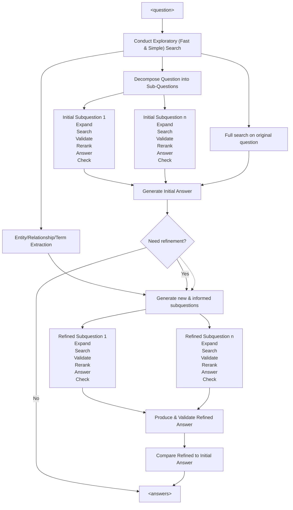

```mermaid
flowchart TB
    Q["&lt;question&gt;"]

    A["Conduct Exploratory (Fast &amp; Simple) Search"]
    B["Full search on original question"]
    C["Decompose Question into Sub-Questions"]

    E["Entity/Relationship/Term Extraction"]

    S1["Initial Subquestion 1<br/>Expand<br/>Search<br/>Validate<br/>Rerank<br/>Answer<br/>Check"]
    SN["Initial Subquestion n<br/>Expand<br/>Search<br/>Validate<br/>Rerank<br/>Answer<br/>Check"]

    G["Generate Initial Answer"]
    N{"Need refinement?"}

    GI["Generate new &amp; informed subquestions"]

    R1["Refined Subquestion 1<br/>Expand<br/>Search<br/>Validate<br/>Rerank<br/>Answer<br/>Check"]
    RN["Refined Subquestion n<br/>Expand<br/>Search<br/>Validate<br/>Rerank<br/>Answer<br/>Check"]

    PV["Produce &amp; Validate Refined Answer"]
    CI["Compare Refined to Initial Answer"]

    ANS["&lt;answers&gt;"]

    Q --> A
    A --> B
    A --> C
    A --> E

    C --> S1
    C --> SN

    S1 --> G
    SN --> G
    B --> G

    E --> GI
    G --> N
    N -- Yes --> GI
    N -- No --> ANS

    GI --> R1
    GI --> RN

    R1 --> PV
    RN --> PV
    PV --> CI
    CI --> ANS

    %% Dashed feedback links from initial/refinement decision to informed subquestions
    N -.-> GI
```
