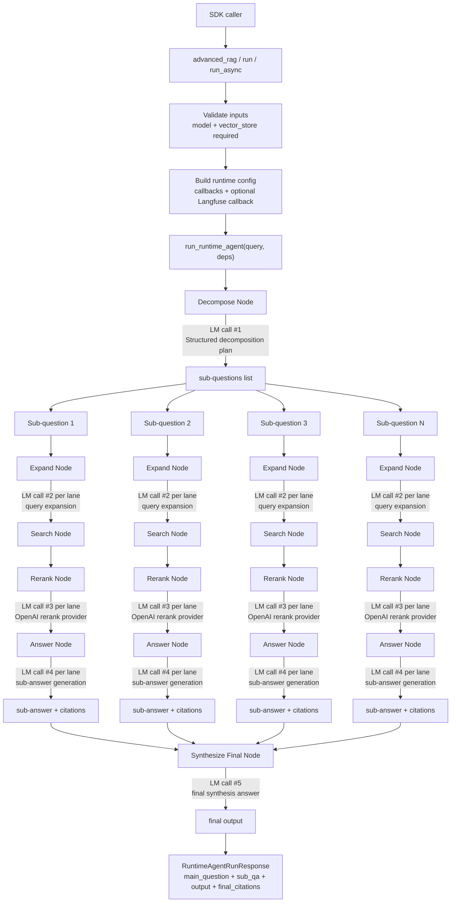

<p align="center">
  
</p>

# agent-search

`agent-search` is a Dockerized RAG application and SDK-style runtime built with FastAPI, React, Postgres, pgvector, and a graph-stage answer pipeline.

## Runtime State Graph (Data Flow + LM Calls)



### Deep Dive

#### Decompose Node

| Field | Details |
| --- | --- |
| Input schema | `DecomposeNodeInput { main_question: str, run_metadata: GraphRunMetadata, initial_search_context: list[dict[str, Any]] }` |
| Output schema | `DecomposeNodeOutput { decomposition_sub_questions: list[str] }` |
| How it works | `run_decomposition_node(...)` calls a structured-output LLM plan, normalizes/dedupes questions, and clamps count to the configured max. |
| Why effective | Converts one broad task into atomic retrieval tasks, which raises recall for multi-hop questions. |
| Knobs | `DECOMPOSITION_ONLY_MODEL`, `DECOMPOSITION_ONLY_TEMPERATURE`, `DECOMPOSITION_ONLY_MAX_SUBQUESTIONS`, `DECOMPOSITION_LLM_TIMEOUT_S`. |
| Potential changes | Adaptive sub-question count from query complexity and token budget. |

```python
from agent_search.runtime.nodes.decompose import run_decomposition_node
from schemas import DecomposeNodeInput, GraphRunMetadata

output = run_decomposition_node(
    node_input=DecomposeNodeInput(
        main_question="How does pgvector indexing affect recall and latency?",
        initial_search_context=[],
        run_metadata=GraphRunMetadata(run_id="run-1"),
    ),
    model=model,
)
print(output.decomposition_sub_questions)
```

#### Expand Node

| Field | Details |
| --- | --- |
| Input schema | `ExpandNodeInput { main_question: str, sub_question: str, run_metadata: GraphRunMetadata }` |
| Output schema | `ExpandNodeOutput { expanded_queries: list[str] }` |
| How it works | `run_expansion_node(...)` generates alternate phrasings for each sub-question via the query expansion service. |
| Why effective | Reduces wording mismatch between question phrasing and chunk text. |
| Knobs | Expansion config (`max_queries`, `max_query_length`, model and temperature in query-expansion settings). |
| Potential changes | Domain-specific expansions and synonym lexicons. |

```python
from agent_search.runtime.nodes.expand import run_expansion_node
from schemas import ExpandNodeInput, GraphRunMetadata

expanded = run_expansion_node(
    node_input=ExpandNodeInput(
        main_question="How does pgvector indexing affect recall and latency?",
        sub_question="What index types does pgvector support?",
        run_metadata=GraphRunMetadata(run_id="run-1"),
    ),
    model=model,
)
print(expanded.expanded_queries)
```

#### Search Node (Similarity Retrieval)

| Field | Details |
| --- | --- |
| Input schema | `SearchNodeInput { sub_question: str, expanded_queries: list[str], run_metadata: GraphRunMetadata }` |
| Output schema | `SearchNodeOutput { retrieved_docs: list[CitationSourceRow], retrieval_provenance: list[dict[str, Any]], citation_rows_by_index: dict[int, CitationSourceRow] }` |
| How it works | `run_search_node(...)` runs similarity search per normalized query, merges duplicate documents, keeps best observed score, and applies a merged cap. |
| Math reasoning | Typical embedding similarity uses cosine: `sim(q,d) = (q·d) / (||q|| ||d||)`. Multi-query retrieval approximates `score(d) = max_i sim(q_i, d)` before downstream rerank. |
| Why effective | Expansion + max-over-queries improves chance that at least one phrasing retrieves the right chunk. |
| Knobs | `retrieval.search_node_k_fetch`, `retrieval.search_node_score_threshold`, `retrieval.search_node_merged_cap`. |
| Potential changes | Hybrid ranking: `score = alpha * vector_score + (1 - alpha) * bm25_score`. |

```python
from agent_search.runtime.nodes.search import run_search_node
from schemas import SearchNodeInput, GraphRunMetadata

searched = run_search_node(
    node_input=SearchNodeInput(
        sub_question="What index types does pgvector support?",
        expanded_queries=["pgvector index types", "ivfflat vs hnsw pgvector"],
        run_metadata=GraphRunMetadata(run_id="run-1"),
    ),
    vector_store=vector_store,
)
print(len(searched.retrieved_docs))
```

#### Rerank Node

| Field | Details |
| --- | --- |
| Input schema | `RerankNodeInput { sub_question: str, expanded_query: str, retrieved_docs: list[CitationSourceRow], run_metadata: GraphRunMetadata }` |
| Output schema | `RerankNodeOutput { reranked_docs: list[CitationSourceRow], citation_rows_by_index: dict[int, CitationSourceRow] }` |
| How it works | `run_rerank_node(...)` calls reranker with the sub-question and candidates, receives a strict JSON ranking, and rewrites evidence order + citation indices. |
| Math reasoning | Rerank estimates relevance per candidate (`s_rerank in [0,1]`) and sorts descending. If fused with retrieval score: `s_final = alpha*s_vec + (1-alpha)*s_rerank`; final rank is `argsort(s_final)`. |
| Why effective | Retrieval is high-recall; rerank is high-precision for top context used by generation. |
| Knobs | `rerank.enabled`, `rerank.provider`, `rerank.top_n`, `RERANK_OPENAI_MODEL_NAME`, `RERANK_OPENAI_TEMPERATURE`, `timeout.rerank_timeout_s`. |
| Potential changes | Add calibrated cutoff to drop low-confidence candidates before answer generation. |

```python
from agent_search.runtime.nodes.rerank import run_rerank_node
from schemas import RerankNodeInput, GraphRunMetadata

reranked = run_rerank_node(
    node_input=RerankNodeInput(
        sub_question="What index types does pgvector support?",
        expanded_query="pgvector index types",
        retrieved_docs=searched.retrieved_docs,
        run_metadata=GraphRunMetadata(run_id="run-1"),
    )
)
print([row.score for row in reranked.reranked_docs[:3]])
```

#### Answer Node

| Field | Details |
| --- | --- |
| Input schema | `AnswerSubquestionNodeInput { sub_question: str, reranked_docs: list[CitationSourceRow], citation_rows_by_index: dict[int, CitationSourceRow], run_metadata: GraphRunMetadata }` |
| Output schema | `AnswerSubquestionNodeOutput { sub_answer: str, citation_indices_used: list[int], answerable: bool, verification_reason: str, citation_rows_by_index: dict[int, CitationSourceRow] }` |
| How it works | `run_answer_node(...)` generates one sub-answer from reranked evidence, extracts citation markers like `[1]`, and validates they map to available rows. |
| Why effective | Enforces citation-supported answers per lane instead of unconstrained generation. |
| Knobs | Generation model + `timeout.subanswer_generation_timeout_s`, `timeout.subanswer_verification_timeout_s`. |
| Potential changes | Add passage-level quote extraction for stricter evidence binding. |

```python
from agent_search.runtime.nodes.answer import run_answer_node
from schemas import AnswerSubquestionNodeInput, GraphRunMetadata

subanswer = run_answer_node(
    node_input=AnswerSubquestionNodeInput(
        sub_question="What index types does pgvector support?",
        reranked_docs=reranked.reranked_docs,
        citation_rows_by_index=reranked.citation_rows_by_index,
        run_metadata=GraphRunMetadata(run_id="run-1"),
    ),
    callbacks=[],
)
print(subanswer.sub_answer, subanswer.citation_indices_used)
```

#### Synthesize Final Node

| Field | Details |
| --- | --- |
| Input schema | `SynthesizeFinalNodeInput { main_question: str, sub_qa: list[SubQuestionAnswer], sub_question_artifacts: list[SubQuestionArtifacts], run_metadata: GraphRunMetadata }` |
| Output schema | `SynthesizeFinalNodeOutput { final_answer: str }` |
| How it works | `run_synthesize_node(...)` composes sub-answers into a final response and enforces a final citation contract (fallback if citations are missing/invalid). |
| Why effective | Produces one coherent answer while preserving lane-level provenance constraints. |
| Knobs | Final synthesis model + `timeout.initial_answer_timeout_s`. |
| Potential changes | Add contradiction detection and confidence scoring across sub-answers. |

```python
from agent_search.runtime.nodes.synthesize import run_synthesize_node
from schemas import SynthesizeFinalNodeInput, GraphRunMetadata

final = run_synthesize_node(
    node_input=SynthesizeFinalNodeInput(
        main_question="How does pgvector indexing affect recall and latency?",
        sub_qa=sub_qa,
        sub_question_artifacts=sub_question_artifacts,
        run_metadata=GraphRunMetadata(run_id="run-1"),
    )
)
print(final.final_answer)
```

## SDK Logic (In-Process)

Before calling `advanced_rag(...)`, install `agent-search-core`, configure your model provider credentials (for example OpenAI), and provide both:
- a chat model instance
- a vector store adapter (`LangChainVectorStoreAdapter`)

```python
from langchain_openai import ChatOpenAI
from langfuse.langchain import CallbackHandler
from agent_search import advanced_rag
from agent_search.vectorstore.langchain_adapter import LangChainVectorStoreAdapter

vector_store = LangChainVectorStoreAdapter(your_langchain_vector_store)
model = ChatOpenAI(model="gpt-4.1-mini", temperature=0.0)
langfuse_callback = CallbackHandler(
    public_key="...",
    secret_key="...",
    host="https://cloud.langfuse.com",
)
response = advanced_rag(
    "What is pgvector?",
    vector_store=vector_store,
    model=model,
    langfuse_callback=langfuse_callback,
)
print(response.output)
```

Output schema for `advanced_rag(...)`:

```python
RuntimeAgentRunResponse(
  main_question: str,
  sub_qa: list[SubQuestionAnswer],
  output: str,
  final_citations: list[CitationSourceRow],
)
```

### Deep Dive

| Focus | Deep dive (how it works, why effective, knobs) | Potential changes |
| --- | --- | --- |
| Setup and required inputs | You install `agent-search-core`, construct a compatible `vector_store` adapter, and pass a chat `model` into `advanced_rag(...)`. The SDK validates both inputs and rejects `None` early to prevent ambiguous runtime failures. | Add a one-call helper that builds a default model + vector store from environment for quick starts. |
| Code path | `advanced_rag(...)` resolves `RuntimeConfig`, validates vector store protocol compatibility, attaches optional callbacks, and executes `run_runtime_agent(...)`. This keeps API surface small while routing all logic through one runtime path. | Add a dry-run mode that validates config and dependencies without performing LLM/vector calls. |
| Why it is effective | The SDK uses typed request/response schemas and deterministic runtime staging, so callers get a stable output contract (`main_question`, `sub_qa`, `output`, `final_citations`) while internals can evolve without breaking integration code. | Add response version tags for explicit forward-compatibility across future schema expansions. |
| Knobs and tradeoffs | Pass `config` to tune `retrieval.*`, `rerank.*`, and `timeout.*`. Larger retrieval/rerank windows generally improve answer quality but increase latency and token usage; tighter timeouts reduce worst-case latency but increase fallback risk. | Expose prebuilt config presets plus per-stage telemetry recommendations in SDK logs. |
