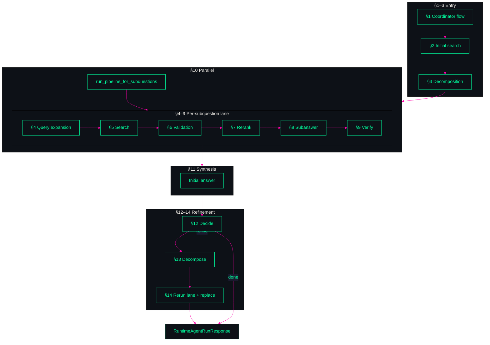
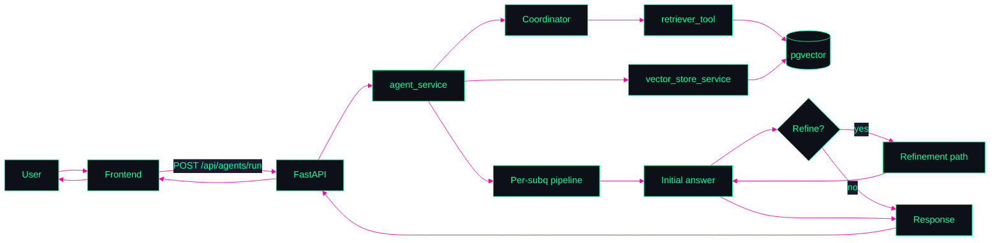

<p align="center">
  
</p>

```text
┏━━━━━━━━━━━━━━━━━━━━━━━━━━━━━━━━━━━━━━━━━━━━━━━━━━━━━━━━━━━━━━━━━━━━━━━━━━━━━━┓
┃ SYSTEM README — AGENT-SEARCH // ARCHITECTURE MAP                             ┃
┃ SDK for world-class RAG: bring your `model` + `vector_store` — we own the flow┃
┗━━━━━━━━━━━━━━━━━━━━━━━━━━━━━━━━━━━━━━━━━━━━━━━━━━━━━━━━━━━━━━━━━━━━━━━━━━━━━━┛
PALETTE: neon #00ff9f / #00ffff  •  magenta #ff00aa / #ff006e  •  dark #0d1117
DISPLAY: best viewed in dark mode (the HUD panels below are designed for it)
```

---

## Purpose

```text
[ PURPOSE ]
```

This project builds an **SDK** that takes your **model**, your **vector store**, and abstracts the logic for building **world-class RAG systems** using a fixed technical flow. You can build products and experiences on top of this pipeline without reimplementing decomposition, retrieval, verification, or refinement—we provide the orchestration, contracts, and traceability.

**Why it exists:** Multi-stage RAG (retrieve → decompose → per-subquestion retrieval → verify → synthesize → optionally refine) is complex and easy to get wrong. This codebase encodes one proven flow: load curated data into a pgvector-backed store, run a coordinator-driven agent pipeline over it, and return a final answer with per-subquestion traceability. The SDK-style boundary (model + vector_store in; structured run out) lets you swap embeddings/LLMs and stores while keeping the same pipeline behavior.

**For whom:** Developers and teams who want a production-ready RAG pipeline they can extend (e.g. different front ends, data sources, or deployment targets) rather than building from scratch.

---

## Overview

```text
[ OVERVIEW // DATA PATHS ]
```

The system has two main paths: **ingestion** (load wiki or other curated sources into Postgres + pgvector) and **answer** (user query → initial retrieval → coordinator-driven decomposition → parallel per-subquestion pipeline → initial synthesis → optional refinement → final response). A React front end and FastAPI backend expose load/wipe/run; the backend delegates decomposition and retrieval to a deep-agent coordinator and runs deterministic Python services for validation, reranking, subanswer generation, and verification. Data flows through typed schemas (`RuntimeAgentRunRequest` / `RuntimeAgentRunResponse`, `SubQuestionAnswer`) and optional refinement replaces the initial answer when the pipeline decides it is insufficient.

---

## Architecture — Parts

```text
[ ARCHITECTURE // PARTS ]
```

The pipeline is documented as **14 sections** in `docs/`. Each section covers one stage of the flow. Summary:

| Section | Role | Doc |
|--------|------|-----|
| **1** | Coordinator flow tracking (`write_todos` + virtual file system) | [section-01-coordinator-flow-tracking](docs/section-01-coordinator-flow-tracking.md) |
| **2** | Initial search for decomposition context (one retrieval before decompose) | [section-02-initial-search-for-decomposition-context](docs/section-02-initial-search-for-decomposition-context.md) |
| **3** | Question decomposition informed by context (sub-questions from coordinator) | [section-03-question-decomposition-informed-by-context](docs/section-03-question-decomposition-informed-by-context.md) |
| **4** | Per-subquestion query expansion (expanded retrieval query) | [section-04-per-subquestion-query-expansion](docs/section-04-per-subquestion-query-expansion.md) |
| **5** | Per-subquestion search (retriever tool + callback capture) | [section-05-per-subquestion-search](docs/section-05-per-subquestion-search.md) |
| **6** | Per-subquestion document validation (parallel) | [section-06-per-subquestion-document-validation-parallel](docs/section-06-per-subquestion-document-validation-parallel.md) |
| **7** | Per-subquestion reranking | [section-07-per-subquestion-reranking](docs/section-07-per-subquestion-reranking.md) |
| **8** | Per-subquestion subanswer generation | [section-08-per-subquestion-subanswer-generation](docs/section-08-per-subquestion-subanswer-generation.md) |
| **9** | Per-subquestion subanswer verification | [section-09-per-subquestion-subanswer-verification](docs/section-09-per-subquestion-subanswer-verification.md) |
| **10** | Parallel sub-question processing (run lane 4–9 in parallel) | [section-10-parallel-sub-question-processing](docs/section-10-parallel-sub-question-processing.md) |
| **11** | Initial answer generation (synthesize from initial context + sub_qa) | [section-11-initial-answer-generation](docs/section-11-initial-answer-generation.md) |
| **12** | Refinement decision (refine or return) | [section-12-refinement-decision](docs/section-12-refinement-decision.md) |
| **13** | Refinement decomposition (refined sub-questions) | [section-13-refinement-decomposition](docs/section-13-refinement-decomposition.md) |
| **14** | Refinement answer path (rerun retrieval + pipeline, replace output) | [section-14-refinement-answer-path](docs/section-14-refinement-answer-path.md) |

```text
HUD NOTE: Diagrams are intended to render neon green/cyan and magenta on dark.
If your renderer ignores Mermaid theming, the layout still communicates the flow.
```

### Flow diagram — Parts (entry → lane → synthesis → refinement)



---

## Architecture — Whole System

```text
[ ARCHITECTURE // WHOLE SYSTEM ]
```

End-to-end: **User** → **Frontend** (Vite + React) → **Backend** (FastAPI) → **Agent service** orchestrates coordinator + vector store + per-subquestion pipeline and optional refinement → **Response** (`main_question`, `sub_qa[]`, `output`) back to frontend. **Ingestion** path: load request → internal data service → wiki ingestion + vector store service → Postgres/pgvector. **Answer** path: run request → initial retrieval → coordinator (decomposition + delegated retrieval) → parallel pipeline (validate → rerank → subanswer → verify) → initial answer → refinement decision → optional refinement loop → final output.

**Deployment:** `frontend` (React, :5173), `backend` (FastAPI, :8000), `db` (Postgres 16 + pgvector). Optional `chrome` for remote debugging (:9222).

```text
HUD NOTE: Whole-system diagram uses the same neon palette as the parts map.
```

### Flow diagram — Whole system



---

## Tradeoffs

```text
[ TRADEOFFS // SIGNAL VS COST ]
```

| Area | Choice | Pros | Cons |
|------|--------|------|------|
| **Orchestration** | Coordinator (deep-agent) for decompose/delegate; deterministic Python for post-retrieval | Flexible decomposition; predictable downstream stages | Mixed control model; tracing is harder |
| **Payload shape** | String-formatted doc payloads between some stages | Easy to log and show in UI | Parsing fragility; extra conversion |
| **Validation / rerank / verify** | Rule-based, deterministic | Low latency/cost; reproducible | Weaker semantic nuance than LLM scorers |
| **Concurrency** | `ThreadPoolExecutor` per subquestion | Better throughput for many subquestions | Noisier errors and log interleaving |
| **Refinement** | Conditional on insufficiency + answerable ratio | Skips second pass when first is good enough | Threshold tuning can misclassify |
| **Reliability** | Fallback when OpenAI unavailable | Usable output under degradation | Answer quality drops vs full LLM |

---

## Quick start

```text
[ QUICK START // BOOT SEQUENCE ]
```

**Prerequisites:** Docker (and Compose), `.env` with `OPENAI_API_KEY` and any overrides for `POSTGRES_*`, `DATABASE_URL`, `VITE_API_BASE_URL`.

```bash
docker compose up -d
```

- **Frontend:** http://localhost:5173  
- **Backend API:** http://localhost:8000  
- **DB:** Postgres 16 + pgvector on port 5432 (default credentials in `docker-compose.yml`).

Backend runs Alembic migrations at startup. Use the UI to load a wiki source, then run a query to exercise the full pipeline.

---

## Links

```text
[ LINKS // REFERENCE CHANNELS ]
```

| Resource | Path |
|----------|------|
| **System architecture** | [docs/SYSTEM_ARCHITECTURE.md](docs/SYSTEM_ARCHITECTURE.md) |
| **Section docs (1–14)** | [docs/section-01-coordinator-flow-tracking.md](docs/section-01-coordinator-flow-tracking.md) … [docs/section-14-refinement-answer-path.md](docs/section-14-refinement-answer-path.md) |
| **Agent/runtime guidance** | [AGENTS.md](AGENTS.md) |

---
