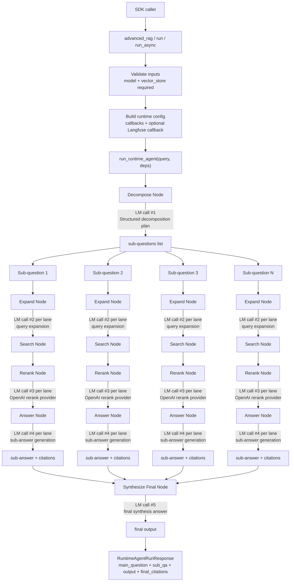

<p align="center">
  
</p>

# agent-search

`agent-search` is a Dockerized RAG application and SDK-style runtime built with FastAPI, React, Postgres, pgvector, and a graph-stage answer pipeline.

## Architecture Decisions

This architecture was inspired by LangChain's write-up on agent search with LangGraph:
- `https://blog.langchain.com/beyond-rag-implementing-agent-search-with-langgraph-for-smarter-knowledge-retrieval/`

Why this approach was effective for this project:
- It maps complex retrieval into explicit node stages with clear dependencies, which makes behavior easier to reason about than a single monolithic RAG prompt.
- It supports fan-out parallel sub-question processing, which improves coverage on ambiguous or multi-entity queries while keeping latency practical.
- It keeps the pipeline extensible: decomposition, expansion, retrieval, reranking, answering, and synthesis can evolve independently without rewriting the whole runtime.

Why this project took inspiration from it:
- The problem profile is similar: broad, ambiguous questions where vanilla single-query retrieval often misses key evidence.
- A graph-style execution model fits the need for traceability, stage-level observability, and controlled fallbacks when a lane has weak evidence.

## Runtime State Graph (Data Flow + LM Calls)



## SDK Logic

Before calling `advanced_rag(...)`, install `agent-search-core`, configure your model provider credentials (for example OpenAI), and provide both:
- a chat model instance
- a vector store adapter (`LangChainVectorStoreAdapter`)

```python
from langchain_openai import ChatOpenAI
from langfuse.langchain import CallbackHandler
from agent_search import advanced_rag
from agent_search.vectorstore.langchain_adapter import LangChainVectorStoreAdapter

vector_store = LangChainVectorStoreAdapter(your_langchain_vector_store)
model = ChatOpenAI(model="gpt-4.1-mini", temperature=0.0)
langfuse_callback = CallbackHandler(
    public_key="...",
    secret_key="...",
    host="https://cloud.langfuse.com",
)
response = advanced_rag(
    "What is pgvector?",
    vector_store=vector_store,
    model=model,
    langfuse_callback=langfuse_callback,
)
print(response.output)
```

Output schema for `advanced_rag(...)`:

```python
RuntimeAgentRunResponse(
  main_question: str,
  sub_qa: list[SubQuestionAnswer],
  output: str,
  final_citations: list[CitationSourceRow],
)
```

## Runtime Node Summary

| Node | Implementation (what the code does) | Math / reasoning | Why effective |
| --- | --- | --- | --- |
| `Decompose` | Uses LangChain prompt + chat model structured output (`DecompositionPlan`) in `run_decomposition_node(...)`, then normalizes, dedupes, and caps sub-question count. | `Q_sub = clip_K(dedupe(norm(parse(LLM(question, context)))))`. | Breaks a broad problem into smaller retrieval tasks, reducing missed evidence on multi-hop questions. |
| `Expand` | Uses `MultiQueryRetriever.from_llm(...)` in `expand_queries_for_subquestion(...)` with a noop retriever to generate query variants only, then keeps original query, normalizes, dedupes, and caps by `max_queries`. | `E = clip_M(dedupe(norm([q] + LLM_variants(q))))`. | Raises recall by covering semantic/lexical variants that one phrasing would miss. |
| `Search` | `search_documents_for_queries(...)` iterates expanded queries and calls `search_documents_for_context(...)`, which uses `similarity_search_with_relevance_scores(...)` when supported (else `similarity_search(...)`), then merges duplicates in `run_search_node(...)`. | Embedding similarity is typically cosine: `sim(q,d) = (q·d)/(||q|| ||d||)`. Multi-query aggregation is effectively max-over-queries before rerank. | Gets high-recall candidate evidence while avoiding duplicate chunks and preserving provenance. |
| `Rerank` | `run_rerank_node(...)` calls `rerank_documents(...)`, which prompts an LLM reranker to return strict JSON ordering/scores and rewrites citation rank/index order. | Rank by `s_rerank` descending; optional fusion form: `s_final = alpha*s_vec + (1-alpha)*s_rerank`. | Converts retrieval recall into precision so answer generation sees better top context. |
| `Answer` | `run_answer_node(...)` generates sub-answer text from reranked docs, extracts citation markers (`[n]`), and validates indices against available citation rows; unsupported answers fall back. | `answerable = (|C_used| > 0) AND (C_used subseteq C_available)`. | Enforces evidence-linked claims per lane instead of unconstrained generation. |
| `Synthesize Final` | `run_synthesize_node(...)` combines lane sub-answers, then enforces final citation contract and falls back to citation-valid content if needed. | `A_final = synth(main_question, sub_qa)` subject to `C_final subseteq C_available`. | Produces one coherent answer while retaining citation integrity across lanes. |
| `Parallel lane execution` | Sub-question lanes run concurrently via `ThreadPoolExecutor` + `as_completed` in `run_parallel_graph_runner(...)` / `run_pipeline_for_subquestions_with_timeout(...)`, bounded by configured worker limits. | Approximate latency drops from `O(sum_i t_i)` toward `O(max_i t_i)` plus scheduling overhead. | Maintains quality from multi-lane reasoning while keeping end-to-end latency practical. |
