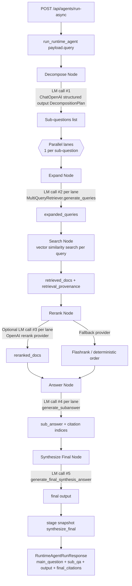

# agent-search

`agent-search` is a Dockerized RAG application and SDK-style runtime built with FastAPI, React, Postgres, pgvector, and a graph-stage answer pipeline.

## Runtime State Graph (Data Flow + LM Calls)



## SDK Logic (In-Process)

Entry points:

- `advanced_rag(query, *, vector_store, model, config=None, callbacks=None, langfuse_callback=None)`
- `run(query, *, vector_store, model, config=None, callbacks=None, langfuse_callback=None)`
- `run_async(query, *, vector_store, model, config=None)`
- `get_run_status(job_id)`
- `cancel_run(job_id)`

Minimal usage (you must provide both a chat model and a vector store):

```python
from langchain_openai import ChatOpenAI
from agent_search import advanced_rag
from agent_search.vectorstore.langchain_adapter import LangChainVectorStoreAdapter

vector_store = LangChainVectorStoreAdapter(your_langchain_vector_store)
model = ChatOpenAI(model="gpt-4.1-mini", temperature=0.0)

response = advanced_rag("What is pgvector?", vector_store=vector_store, model=model)
print(response.output)
```

`run(...)` remains available as a compatibility alias and delegates to `advanced_rag(...)`.

Tracing behavior for `advanced_rag(...)`:

- Pass `langfuse_callback=...` to supply an explicit callback.
- If omitted, SDK attempts to build a Langfuse callback from environment settings + sampling.

The SDK does not auto-build a model or vector store. When running the full app in this repo, the backend constructs those dependencies for API calls.

PyPI description:

- `https://pypi.org/project/agent-search-core/`
