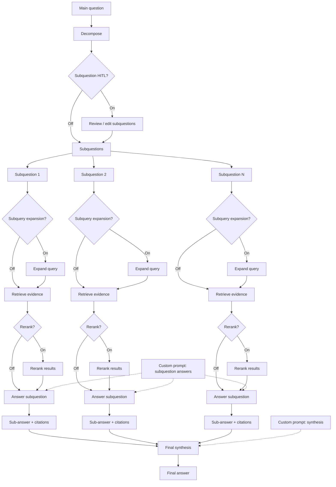
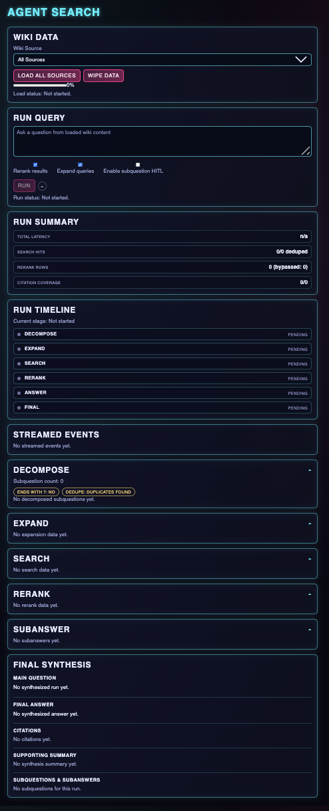

<p align="center">
  
</p>

# agent-search

`agent-search` supercharges your RAG flow by improving accuracy with our open-source framework, backed by the Onyx team’s work on agentic search with LangGraph: https://onyx.app/blog/agent-search-with-langgraph?ref=blog.langchain.com.

Onyx builds AI search and knowledge experiences for teams that need dependable, source-grounded answers. Agent-search distills those production learnings into a developer SDK so you can ship more reliable retrieval flows without rebuilding the orchestration stack from scratch.

## Documentation

The consolidated project reference is available at `docs/application-document.html`. It is the agent-search-specific HTML source of truth for architecture, concerns, conventions, integrations, stack, structure, testing, runtime flow, and key tradeoffs, including the current no-timeout-guardrails runtime behavior.

Live architecture blog (GitHub Pages): [https://nickbohm555.github.io/agent-search/architecture.html](https://nickbohm555.github.io/agent-search/architecture.html).

## Data Flow Diagram



## SDK Quick Reference (PyPI)

For the full, canonical SDK docs, see [https://pypi.org/project/agent-search-core/](https://pypi.org/project/agent-search-core/).

The PyPI package is an in-process Python SDK for `agent-search`. It is intentionally narrow: consumers should call `advanced_rag(...)` and treat that as the supported entrypoint. The SDK always requires both:

- A chat model (for example `langchain_openai.ChatOpenAI`)
- A vector store that implements `similarity_search(query, k, filter=None)`

It does not auto-build these dependencies for you.

**Install (PyPI)**

```bash
python3.11 -m venv .venv
source .venv/bin/activate
pip install --upgrade pip
pip install agent-search-core
python -c "import agent_search; print(agent_search.__file__)"
```

**Quick Start**

```python
from langchain_openai import ChatOpenAI
from agent_search import advanced_rag
from agent_search.vectorstore.langchain_adapter import LangChainVectorStoreAdapter

vector_store = LangChainVectorStoreAdapter(your_langchain_vector_store)
model = ChatOpenAI(model="gpt-4.1-mini", temperature=0.0)

response = advanced_rag(
    "What is pgvector?",
    vector_store=vector_store,
    model=model,
)
print(response.output)
```

**Contract Notes For 1.0.17**

Use these canonical names in new `config` payloads:

- `custom_prompts`
- `runtime_config`

Compatibility notes:

- `custom-prompts` is still accepted as an input alias, but new code should send `custom_prompts`.
- `advanced_rag(...)` remains the supported sync entrypoint for `agent-search-core`.
- For HITL flows, use the checkpointed runtime runner described below.
- Langfuse tracing is no longer supported in the SDK/runtime.

**Human-In-The-Loop (HITL)**

`agent-search-core` supports one opt-in review stage on `advanced_rag(...)`:

- `hitl_subquestions=True` pauses after decomposition so the caller can review or edit subquestions.
- Subquestion review is the only HITL checkpoint in the SDK.
- Query expansion no longer has a separate review checkpoint.

The SDK returns a normalized `review` object when a run pauses, and resume calls use SDK-owned decision helpers instead of raw backend payloads.

HITL checkpoint persistence is optional overall because non-HITL runs do not need it. For HITL or resume flows, provide one of these options and do not pass both at once:

- `checkpoint_db_url="postgresql+psycopg://..."` when you want the SDK to create and own the LangGraph Postgres checkpointer for the call.
- `checkpointer=existing_checkpointer` when you already manage a ready-to-use LangGraph checkpoint saver instance.

Do not pass both at once.

When you use `checkpoint_db_url`, the caller must provide the checkpoint Postgres database explicitly on every checkpointed call:

- Provision a reachable Postgres database for LangGraph checkpoints before enabling HITL.
- Pass `checkpoint_db_url="postgresql+psycopg://..."` to every HITL or resume call; the runtime uses that DB for checkpoint persistence and bootstraps tables on first use if missing.

If you inject `checkpointer`, that saver is used as-is and the SDK does not create or bootstrap a new one for you.

**Optional Parameters**

`advanced_rag(...)` supports these optional keyword parameters:

- `rerank_enabled`: explicit per-call override for whether the rerank node runs.
- `query_expansion_enabled`: explicit per-call override for whether the query-expansion node runs.
- `config`: runtime controls and prompt overrides for `rerank`, `query_expansion`, `hitl`, `runtime_config`, and `custom_prompts`.
- `callbacks`: LangChain-compatible callbacks that should observe the run.
- `hitl_subquestions`: enable the SDK HITL pause after decomposition.
- `resume`: resume payload for a paused HITL run.
- `checkpoint_db_url`: optional for normal runs, required only for HITL/resume flows if you are not passing `checkpointer`.
- `checkpointer`: injected LangGraph checkpoint saver; use this instead of `checkpoint_db_url` when you already manage a ready-to-use saver instance.

Normal non-HITL runs can omit both `checkpoint_db_url` and `checkpointer`.

**Prompt Customization**

The SDK currently exposes two prompt override keys:

- `custom_prompts.subanswer`
- `custom_prompts.synthesis`

If you do not override them, the runtime uses built-in defaults. Overrides replace the instruction block only. The SDK always appends the live `main_question`, `sub_question`, and evidence sections itself, so caller-provided prompt text cannot replace runtime inputs. For broader runtime and prompt behavior details, see `docs/application-document.html`.

**Example Flow**

Screenshot of the end-to-end flow with subquestion review, optional query expansion and reranking, and final synthesis.


