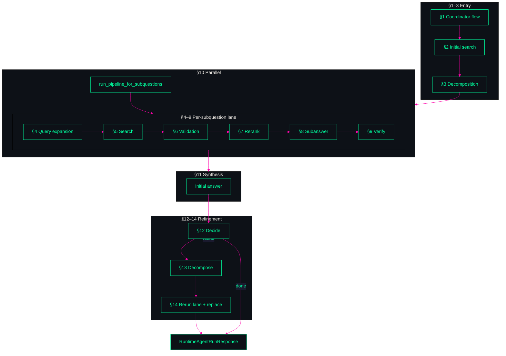
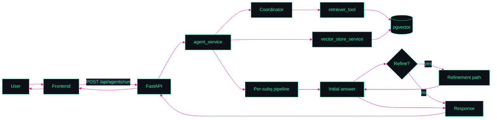

<p align="center">
  
</p>

# agent-search

**A plug-and-play RAG SDK that turns your `model` + `vector_store` into a multi-stage, traceable answer pipeline.**  
Ship faster with coordinator-driven decomposition, parallel per-subquestion retrieval, evidence checks, and an optional refinement loop—without rebuilding the plumbing.

```text
┏━━━━━━━━━━━━━━━━━━━━━━━━━━━━━━━━━━━━━━━━━━━━━━━━━━━━━━━━━━━━━━━━━━━━━━━━━━━━━━┓
┃ SYSTEM README — AGENT-SEARCH // ARCHITECTURE MAP                             ┃
┃ SDK for world-class RAG: bring your `model` + `vector_store` — we own the flow┃
┗━━━━━━━━━━━━━━━━━━━━━━━━━━━━━━━━━━━━━━━━━━━━━━━━━━━━━━━━━━━━━━━━━━━━━━━━━━━━━━┛
PALETTE: neon #00ff9f / #00ffff  •  magenta #ff00aa / #ff006e  •  dark #0d1117
DISPLAY: best viewed in dark mode (the HUD panels below are designed for it)
```

<p align="center">
  
</p>

---

## Purpose

```text
[ PURPOSE ]
```

This project builds an **SDK** that takes your **model**, your **vector store**, and abstracts the logic for building **world-class RAG systems** using a fixed technical flow. You can build products and experiences on top of this pipeline without reimplementing decomposition, retrieval, verification, or refinement—we provide the orchestration, contracts, and traceability.

**Why it exists:** Multi-stage RAG (retrieve → decompose → per-subquestion retrieval → verify → synthesize → optionally refine) is complex and easy to get wrong. This codebase encodes one proven flow: load curated data into a pgvector-backed store, run a coordinator-driven agent pipeline over it, and return a final answer with per-subquestion traceability. The SDK-style boundary (model + vector_store in; structured run out) lets you swap embeddings/LLMs and stores while keeping the same pipeline behavior.

**For whom:** Developers and teams who want a production-ready RAG pipeline they can extend (e.g. different front ends, data sources, or deployment targets) rather than building from scratch.

<p align="center">
  
</p>

---

## Overview

```text
[ OVERVIEW // DATA PATHS ]
```

The system has two main paths: **ingestion** (load wiki or other curated sources into Postgres + pgvector) and **answer** (user query → initial retrieval → coordinator-driven decomposition → parallel per-subquestion pipeline → initial synthesis → optional refinement → final response). A React front end and FastAPI backend expose load/wipe/run; the backend delegates decomposition and retrieval to a deep-agent coordinator and runs deterministic Python services for validation, subanswer generation, and verification, with `flashrank`-backed reranking for production evidence ordering. Data flows through typed schemas (`RuntimeAgentRunRequest` / `RuntimeAgentRunResponse`, `SubQuestionAnswer`) and optional refinement replaces the initial answer when the pipeline decides it is insufficient.

The runtime service also defines graph-state contracts for staged migration: `AgentGraphState`, `SubQuestionArtifacts`, node IO models (`DecomposeNodeInput/Output`, `ExpandNodeInput/Output`, `SearchNodeInput/Output`, `RerankNodeInput/Output`, `AnswerSubquestionNodeInput/Output`, `SynthesizeFinalNodeInput/Output`), plus run observability metadata (`run_id`, `thread_id`, `trace_id`, `correlation_id`) shared with Langfuse tracing conventions.

<p align="center">
  
</p>

---

## Architecture — Parts

```text
[ ARCHITECTURE // PARTS ]
```

The pipeline is documented as **14 sections** in `docs/`. Each section covers one stage of the flow. Summary:

| Section | Role | Doc |
|--------|------|-----|
| **1** | Coordinator flow tracking (`write_todos` + virtual file system) | [section-01-coordinator-flow-tracking](docs/section-01-coordinator-flow-tracking.md) |
| **2** | Initial search for synthesis context (one retrieval before decomposition) | [section-02-initial-search-for-decomposition-context](docs/section-02-initial-search-for-decomposition-context.md) |
| **3** | Question decomposition (question-only input) | [section-03-question-decomposition-informed-by-context](docs/section-03-question-decomposition-informed-by-context.md) |
| **4** | Per-subquestion query expansion (expanded retrieval query) | [section-04-per-subquestion-query-expansion](docs/section-04-per-subquestion-query-expansion.md) |
| **5** | Per-subquestion search (retriever tool + callback capture) | [section-05-per-subquestion-search](docs/section-05-per-subquestion-search.md) |
| **6** | Per-subquestion document validation (parallel) | [section-06-per-subquestion-document-validation-parallel](docs/section-06-per-subquestion-document-validation-parallel.md) |
| **7** | Per-subquestion reranking | [section-07-per-subquestion-reranking](docs/section-07-per-subquestion-reranking.md) |
| **8** | Per-subquestion subanswer generation | [section-08-per-subquestion-subanswer-generation](docs/section-08-per-subquestion-subanswer-generation.md) |
| **9** | Per-subquestion subanswer verification | [section-09-per-subquestion-subanswer-verification](docs/section-09-per-subquestion-subanswer-verification.md) |
| **10** | Parallel sub-question processing (run lane 4–9 in parallel) | [section-10-parallel-sub-question-processing](docs/section-10-parallel-sub-question-processing.md) |
| **11** | Initial answer generation (synthesize from initial context + sub_qa) | [section-11-initial-answer-generation](docs/section-11-initial-answer-generation.md) |
| **12** | Refinement decision (refine or return) | [section-12-refinement-decision](docs/section-12-refinement-decision.md) |
| **13** | Refinement decomposition (refined sub-questions) | [section-13-refinement-decomposition](docs/section-13-refinement-decomposition.md) |
| **14** | Refinement answer path (rerun retrieval + pipeline, replace output) | [section-14-refinement-answer-path](docs/section-14-refinement-answer-path.md) |

```text
HUD NOTE: Diagrams are intended to render neon green/cyan and magenta on dark.
If your renderer ignores Mermaid theming, the layout still communicates the flow.
```

### Flow diagram — Parts (entry → lane → synthesis → refinement)



<p align="center">
  
</p>

---

## Architecture — Whole System

```text
[ ARCHITECTURE // WHOLE SYSTEM ]
```

End-to-end: **User** → **Frontend** (Vite + React) → **Backend** (FastAPI) → **Agent service** orchestrates coordinator + vector store + per-subquestion pipeline and optional refinement → **Response** (`main_question`, `sub_qa[]`, `output`) back to frontend. **Ingestion** path: load request → internal data service → wiki ingestion + vector store service → Postgres/pgvector. **Answer** path: run request → initial retrieval → coordinator (decomposition + delegated retrieval) → parallel pipeline (validate → rerank → subanswer → verify) → initial answer → refinement decision → optional refinement loop → final output.

**Deployment:** `frontend` (React, :5173), `backend` (FastAPI, :8000), `db` (Postgres 16 + pgvector). Optional `chrome` for remote debugging (:9222).

```text
HUD NOTE: Whole-system diagram uses the same neon palette as the parts map.
```

### Flow diagram — Whole system



<p align="center">
  
</p>

---

## Run Flow — UI to Backend to Response

```text
[ RUN FLOW // EXECUTION TRACE ]
```

This section migrates the runtime logic formerly documented in `src/frontend/public/run-flow.html` into this README.

### Reference image (same run-flow diagram)

<p align="center">
  
</p>

### Exact function call chain

```text
UI click/submit
  -> src/frontend/src/App.tsx
     handleRun(event)
       -> runAgent(submittedQuery)
          -> requestJson("/api/agents/run", { method:"POST", payload:{ query }, timeoutMs })
             -> fetch("http://localhost:8000/api/agents/run", ...)

Backend
  -> src/backend/routers/agent.py
     runtime_agent_run(payload, db)
       -> run_runtime_agent(payload, db)
```

### Frontend path (Run button -> network)

| Step | Function | What happens | Data in/out |
|------|----------|--------------|-------------|
| 1 | `App.tsx::handleRun` | Prevent default submit, trim query, set `runState="loading"`, clear previous output. | In: textarea text. Out: React state updates. |
| 2 | `utils/api.ts::runAgent` | Calls `requestJson` with `POST` and long timeout (10 min default). | In: `{ query }`. Out: `ApiResult<RuntimeAgentRunResponse>`. |
| 3 | `utils/api.ts::requestJson` | Calls `fetch` against `API_BASE_URL + /api/agents/run`. | Base URL: `VITE_API_BASE_URL` or `http://localhost:8000`. |
| 4 | `App.tsx::handleRun` success/error branch | Success stores `output` + `sub_qa`; failure sets UI error state. | UI renders final answer and subquestion details. |

### Backend HTTP entry

- Route: `src/backend/routers/agent.py::runtime_agent_run`
- Endpoint: `POST /api/agents/run`
- Request: `RuntimeAgentRunRequest { query }`
- Response: `RuntimeAgentRunResponse { main_question, sub_qa[], output }`

### Runtime pipeline map (orders 1-18)

| Order | Function | Core logic | Output |
|------|----------|------------|--------|
| 1 | `get_vector_store` | Opens/creates PGVector collection. | Vector store handle. |
| 2 | `search_documents_for_context` | Initial retrieval on user question. | Top-k context docs. |
| 3 | `build_initial_search_context` | Normalizes docs to rank/doc_id/title/source/snippet. | `initial_search_context[]`. |
| 4 | `run_decomposition_node` | Graph-entry decomposition node that emits normalized decomposition state. | `decomposition_sub_questions[]`. |
| 5 | `_run_decomposition_only_llm_call` + `_parse_decomposition_output` | Internal helpers used by decomposition node for LLM call + normalization/fallback. | Candidate + normalized subquestions. |
| 6 | `run_expand_node` + `expand_queries_for_subquestion` | Expansion-node query generation (`MultiQueryRetriever`) with bounded normalization and fallback to original sub-question. | `expanded_queries[]` per sub-question artifact. |
| 7 | `run_search_node` + `apply_search_node_output_to_graph_state` | Search-node retrieval over expanded queries with `k_fetch`, deterministic merge/dedupe (`document_id` preferred; fallback `source+content`), and retrieval provenance capture. | `retrieved_docs[]`, `citation_rows_by_index`, and `retrieval_provenance[]` in graph artifacts. |
| 8 | `run_rerank_node` + `apply_rerank_node_output_to_graph_state` | Rerank-node scoring with `flashrank`; trims to `top_n`, preserves deterministic fallback order when reranker fails/disabled, and stores rerank score/order provenance. | `reranked_docs[]` + updated citation map and compatibility payload fields. |
| 9 | `run_answer_subquestion_node` + `apply_answer_subquestion_node_output_to_graph_state` | Subanswer-node generation + verification over reranked docs; requires citation markers and supporting citation rows; falls back to exact `nothing relevant found` when unsupported. | `sub_answer`, citation usage, and supporting source rows in graph/compat state. |
| 9a | `run_synthesize_final_node` + `apply_synthesize_final_node_output_to_graph_state` | Final synthesis-node helper that composes final answer from collected subanswers while preserving citation markers and writes graph compatibility fields. | `final_answer` + `output` in graph state. |
| 10 | `create_coordinator_agent` | Builds coordinator + retriever-backed RAG subagent. | Runnable agent. |
| 11 | `agent.invoke` | Delegates subquestions; runs retriever tool calls. | Agent messages + tool outputs. |
| 12 | `_extract_sub_qa` | Builds `SubQuestionAnswer[]` from captured tool calls/messages. | Seed `sub_qa[]`. |
| 13 | `run_pipeline_for_subquestions` | Per-subquestion parallel pipeline: validate -> rerank -> subanswer -> verify. | Enriched `sub_qa[]`. |
| 14 | `generate_initial_answer` | Synthesizes answer from initial context + subanswers. | Initial `output`. |
| 15 | `should_refine` | Checks insufficiency/answerable ratio threshold. | Refinement decision. |
| 16 | `refine_subquestions` (conditional) | Generates targeted refined subquestions. | `refined_subquestions[]`. |
| 17 | `_seed_refined_sub_qa_from_retrieval` + pipeline (conditional) | Parallel retrieval + rerun lane for refined questions. | `refined_sub_qa[]`. |
| 18 | `generate_initial_answer` again (conditional) | Re-synthesizes from refined evidence. | Refined/final `output`. |
| 19 | Return `RuntimeAgentRunResponse` | Sends result JSON to frontend. | `{ main_question, sub_qa, output }`. |

### Parallelism points

- `run_pipeline_for_subquestions` parallelizes by subquestion with `ThreadPoolExecutor`.
- Per-document validation inside document validation service is also parallelized.
- Refinement retrieval seeding (`_seed_refined_sub_qa_from_retrieval`) is parallelized across refined subquestions.
- Output order is restored by writing future results back to original indices.

### Retriever contract and evidence shape

The RAG subagent calls `search_database(query, expanded_query, limit, wiki_source_filter)` in `src/backend/tools/retriever_tool.py` and returns line-oriented evidence:

```text
1. title={title} source={source} content={content}
2. title={title} source={source} content={content}
...
```

That stable line contract is reused across validation, reranking, subanswer generation, and verification.

### Fallback behavior

- Missing `OPENAI_API_KEY`: decomposition/subanswer/synthesis/refinement-decomposition use deterministic fallback logic.
- Malformed decomposition output: falls back to normalized original question.
- No supportable subanswer from reranked docs in graph-node path: returns exact fallback text `nothing relevant found`.
- Refinement triggers when answer is empty/insufficient, no subanswers exist, or answerable ratio is below threshold.

<p align="center">
  
</p>

---

## Tradeoffs

```text
[ TRADEOFFS // SIGNAL VS COST ]
```

| Area | Choice | Pros | Cons |
|------|--------|------|------|
| **Orchestration** | Coordinator (deep-agent) for decompose/delegate; deterministic Python for post-retrieval | Flexible decomposition; predictable downstream stages | Mixed control model; tracing is harder |
| **Payload shape** | String-formatted doc payloads between some stages | Easy to log and show in UI | Parsing fragility; extra conversion |
| **Validation / rerank / verify** | Deterministic validation + `flashrank` rerank + heuristic verify | Better semantic ranking while keeping controllable latency | Extra reranker model dependency and potential cold-start download cost |
| **Concurrency** | `ThreadPoolExecutor` per subquestion | Better throughput for many subquestions | Noisier errors and log interleaving |
| **Refinement** | Conditional on insufficiency + answerable ratio | Skips second pass when first is good enough | Threshold tuning can misclassify |
| **Reliability** | Fallback when OpenAI unavailable | Usable output under degradation | Answer quality drops vs full LLM |

<p align="center">
  
</p>

---

## Quick start

```text
[ QUICK START // BOOT SEQUENCE ]
```

**Prerequisites:** Docker (and Compose), `.env` with `OPENAI_API_KEY` and any overrides for `POSTGRES_*`, `DATABASE_URL`, `VITE_API_BASE_URL`.

```bash
docker compose up -d
```

- **Frontend:** http://localhost:5173  
- **Backend API:** http://localhost:8000  
- **DB:** Postgres 16 + pgvector on port 5432 (default credentials in `docker-compose.yml`).

Backend runs Alembic migrations at startup. Use the UI to load a wiki source, then run a query to exercise the full pipeline.

<p align="center">
  
</p>

---

## OpenAPI spec

Canonical OpenAPI export artifact:

- Path: `openapi.json` (repo root)
- Format: JSON (OpenAPI 3.x)

Export command:

```bash
uv run --project src/backend python scripts/export_openapi.py
```

Validation command:

```bash
./scripts/validate_openapi.sh
```

Direct Docker equivalent:

```bash
docker run --rm -v "$(pwd):/local" openapitools/openapi-generator-cli validate -i /local/openapi.json
```

Generate Python SDK with Docker (no local OpenAPI Generator install):

```bash
docker run --rm \
  -u "$(id -u):$(id -g)" \
  -v "$(pwd):/local" \
  openapitools/openapi-generator-cli generate \
  -i /local/openapi.json \
  -g python \
  -o /local/sdk/python
```

Generate Python SDK with the repo script (single invocation):

```bash
./scripts/generate_sdk.sh
```

### SDK output location and repo policy

- Canonical generated SDK path: `sdk/python`
- Repo policy: generated SDK files in `sdk/python` are committed to git.
- `.gitignore` intentionally does not ignore `sdk/python`; regenerate with `./scripts/generate_sdk.sh` whenever `openapi.json` changes.

## Links

```text
[ LINKS // REFERENCE CHANNELS ]
```

| Resource | Path |
|----------|------|
| **System architecture** | [docs/SYSTEM_ARCHITECTURE.md](docs/SYSTEM_ARCHITECTURE.md) |
| **Section docs (1–14)** | [docs/section-01-coordinator-flow-tracking.md](docs/section-01-coordinator-flow-tracking.md) … [docs/section-14-refinement-answer-path.md](docs/section-14-refinement-answer-path.md) |
| **Agent/runtime guidance** | [AGENTS.md](AGENTS.md) |

<p align="center">
  
</p>

---

## Inspiration / Articles Used

```text
[ INSPIRATION // EXTERNAL SIGNAL ]
```

- Toloka: [RAG Evaluation: A Technical Guide to Measuring Retrieval-Augmented Generation](https://toloka.ai/blog/rag-evaluation-a-technical-guide-to-measuring-retrieval-augmented-generation/?utm_source=chatgpt.com)
- LangChain: [Beyond RAG: Implementing Agent Search with LangGraph for Smarter Knowledge Retrieval](https://blog.langchain.com/beyond-rag-implementing-agent-search-with-langgraph-for-smarter-knowledge-retrieval/)
- Onyx: [Building the Best Deep Research](https://onyx.app/blog/building-the-best-deep-research)
- Onyx: [Benchmarking Agentic RAG on Workplace Questions](https://onyx.app/blog/benchmarking-agentic-rag-on-workplace-questions)

---
