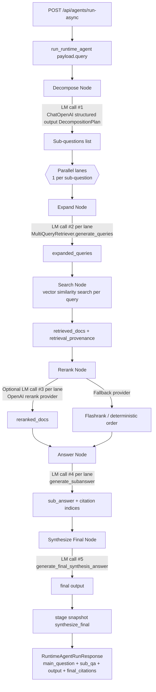

<p align="center">
  
</p>

# agent-search

`agent-search` is a Dockerized RAG application and SDK-style runtime built with FastAPI, React, Postgres, pgvector, and a graph-stage answer pipeline.

## Runtime Contract

Canonical stage order:

`decompose -> expand -> search -> rerank -> answer -> synthesize`

Stable response payload:

`RuntimeAgentRunResponse { main_question, sub_qa[], output }`

## Runtime State Graph (Data Flow + LM Calls)



Primary latency/failure hotspots in this graph:

- Per-lane search (vector DB I/O and fan-out volume).
- Decomposition, expansion, subanswer, and final synthesis LM calls.
- Rerank LM provider when `RERANK_PROVIDER=openai` (extra LM call per lane).
- Large decomposition count (more lanes) with constrained `_GRAPH_RUNNER_MAX_WORKERS`.
- Timeout guardrails that trigger fallback paths and partial outputs:
  `DECOMPOSITION_LLM_TIMEOUT_S`, `INITIAL_SEARCH_TIMEOUT_S`, `RERANK_TIMEOUT_S`,
  `SUBANSWER_GENERATION_TIMEOUT_S`.

## Stack

- Backend: FastAPI + `uv` + Alembic
- Frontend: React + TypeScript + Vite
- Database: Postgres 16 + pgvector
- Retrieval expansion: LangChain `MultiQueryRetriever`
- Reranking: `flashrank` / model rerank path
- Runtime SDK package: `src/backend/agent_search`

## Quick Start

```bash
docker compose build
docker compose up -d
```

- Frontend: `http://localhost:5173`
- Backend: `http://localhost:8000`
- Health: `http://localhost:8000/api/health`

## Core Ops Commands

```bash
# status and logs
docker compose ps
docker compose logs -f
docker compose logs -f backend
docker compose logs -f frontend
docker compose logs -f db

# common refresh loop
docker compose restart backend

# full reset
docker compose down -v --rmi all
docker compose build
docker compose up -d
```

## Runtime API Endpoints

- `GET /api/health`
- `POST /api/agents/run`
- `POST /api/agents/run-async`
- `GET /api/agents/run-status/{job_id}`
- `POST /api/agents/run-cancel/{job_id}`

Minimal async run example:

```bash
curl -sS -X POST http://localhost:8000/api/agents/run-async \
  -H 'Content-Type: application/json' \
  -d '{"query":"What is pgvector?"}'

curl -sS http://localhost:8000/api/agents/run-status/<job_id>
```

## In-Process SDK (Primary)

The primary SDK is in-process Python usage through `agent_search`.

Install from PyPI:

```bash
python3.11 -m venv .venv
source .venv/bin/activate
pip install --upgrade pip
pip install agent-search-core
python -c "import agent_search; print(agent_search.__file__)"
```

Entry points:

- `advanced_rag(query, *, vector_store, model, config=None, callbacks=None, langfuse_callback=None)`
- `run(query, *, vector_store, model, config=None, callbacks=None, langfuse_callback=None)`
- `run_async(query, *, vector_store, model, config=None)`
- `get_run_status(job_id)`
- `cancel_run(job_id)`

Minimal usage (you must provide both a chat model and a vector store):

```python
from langchain_openai import ChatOpenAI
from agent_search import advanced_rag
from agent_search.vectorstore.langchain_adapter import LangChainVectorStoreAdapter

vector_store = LangChainVectorStoreAdapter(your_langchain_vector_store)
model = ChatOpenAI(model="gpt-4.1-mini", temperature=0.0)

response = advanced_rag("What is pgvector?", vector_store=vector_store, model=model)
print(response.output)
```

`run(...)` remains available as a compatibility alias and delegates to `advanced_rag(...)`.

Tracing behavior for `advanced_rag(...)`:
- Pass `langfuse_callback=...` to supply an explicit callback.
- If omitted, SDK attempts to build a Langfuse callback from environment settings + sampling.

The SDK does not auto-build a model or vector store. When running the full app in this repo, the backend constructs those dependencies for API calls.

Error taxonomy:

- `SDKConfigurationError`
- `SDKRetrievalError`
- `SDKModelError`
- `SDKTimeoutError`

Vector-store contract:

- `similarity_search(query, k, filter=None) -> list[Document]`
- Use `LangChainVectorStoreAdapter` when adapting a LangChain vector store instance.

## SDK PyPI Release

Core SDK release instructions are documented in [`sdk/core/README.md`](sdk/core/README.md).

Release requirements summary:

- Tag format: `agent-search-core-vX.Y.Z`
- Tag version must match `sdk/core/pyproject.toml` `version`
- Dry-run release check: `./scripts/release_sdk.sh`
- Publish release: `PUBLISH=1 TWINE_API_TOKEN=*** ./scripts/release_sdk.sh`
- Release script validates wheel contents include `agent_search/` before upload.

## Generated HTTP SDK (Secondary)

Generated API client artifacts are under `sdk/python` and come from `openapi.json`.

```bash
uv run --project src/backend python scripts/export_openapi.py
./scripts/validate_openapi.sh
./scripts/generate_sdk.sh
```

## Benchmark System

Benchmark execution is disabled by default.

```bash
BENCHMARKS_ENABLED=false
VITE_BENCHMARKS_ENABLED=false
```

Enable both flags only when you intentionally want benchmark APIs/CLI/UI available.

Benchmark HTTP API:

- `POST /api/benchmarks/runs`
- `GET /api/benchmarks/runs`
- `GET /api/benchmarks/runs/{run_id}`
- `GET /api/benchmarks/runs/{run_id}/compare`
- `POST /api/benchmarks/runs/{run_id}/cancel`
- `POST /api/benchmarks/wipe`

Create a benchmark run:

```bash
curl -sS -X POST http://localhost:8000/api/benchmarks/runs \
  -H 'Content-Type: application/json' \
  -d '{
    "dataset_id": "internal_v1",
    "modes": ["baseline_retrieve_then_answer", "agentic_default"]
  }'
```

List runs and inspect one run:

```bash
curl -sS http://localhost:8000/api/benchmarks/runs
curl -sS http://localhost:8000/api/benchmarks/runs/<run_id>
curl -sS http://localhost:8000/api/benchmarks/runs/<run_id>/compare
```

Benchmark CLI (backend container):

```bash
# validate run plan only
docker compose exec backend uv run python benchmarks/run.py \
  --dataset-id internal_v1 \
  --mode baseline_retrieve_then_answer \
  --dry-run

# execute small operator run
docker compose exec backend uv run python benchmarks/run.py \
  --dataset-id internal_v1 \
  --mode baseline_retrieve_then_answer \
  --max-questions 1

# export latest run (or pass --run-id)
docker compose exec backend uv run python benchmarks/export.py
```

## Langfuse Setup (Runtime + Benchmark)

Langfuse tracing is optional. Set env vars in `.env` and restart backend.

```bash
LANGFUSE_ENABLED=true
LANGFUSE_BASE_URL=https://cloud.langfuse.com
LANGFUSE_PUBLIC_KEY=pk_...
LANGFUSE_SECRET_KEY=sk_...
LANGFUSE_ENVIRONMENT=development
LANGFUSE_RELEASE=0.1.0
LANGFUSE_RUNTIME_SAMPLE_RATE=1.0
LANGFUSE_BENCHMARK_SAMPLE_RATE=1.0
```

Then apply changes:

```bash
docker compose restart backend
docker compose logs --tail=200 backend
```

## Data and DB Operations

```bash
# Alembic
docker compose exec backend uv run alembic upgrade head
docker compose exec backend uv run alembic history
docker compose exec backend uv run alembic current

# pgvector + tables
docker compose exec db psql -U agent_user -d agent_search -c "\\dx"
docker compose exec db psql -U agent_user -d agent_search -c "\\dt"

# wipe loaded internal docs/chunks only
curl -sS -X POST http://localhost:8000/api/internal-data/wipe
```

## Test Commands

```bash
docker compose exec backend uv run pytest
docker compose exec backend uv run pytest tests/api -m smoke
docker compose exec frontend npm run test
docker compose exec frontend npm run typecheck
docker compose exec frontend npm run build
```

## References

- Runtime flow artifact: `src/frontend/public/run-flow.html`
- Architecture doc: `docs/SYSTEM_ARCHITECTURE.md`
- Agent ops guide: `AGENTS.md`
