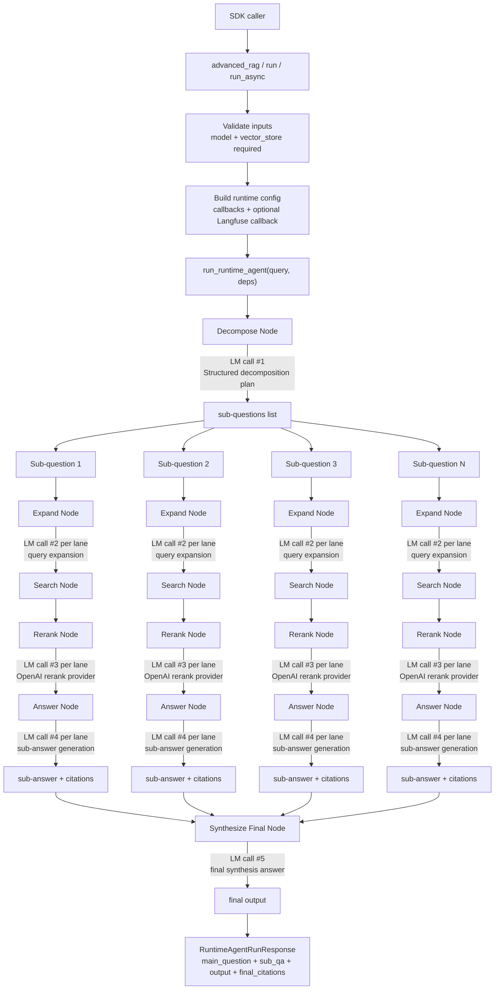

<p align="center">
  
</p>

# agent-search

`agent-search` is a Dockerized RAG application and SDK-style runtime built with FastAPI, React, Postgres, pgvector, and a graph-stage answer pipeline.

## Runtime State Graph (Data Flow + LM Calls)



### Deep Dive

| Focus | Deep dive (how it works, why effective, knobs) | Potential changes |
| --- | --- | --- |
| Pipeline mechanics | The runtime decomposes one question into multiple sub-questions, runs each lane through expand -> search -> rerank -> answer, then synthesizes one final answer. This isolates evidence gathering per claim before global synthesis. | Add an adaptive lane planner that sets lane count based on question complexity instead of a fixed decomposition target. |
| Why it is effective | Decomposition improves recall on multi-hop questions, while per-lane answers reduce cross-topic contamination. Final synthesis reconciles overlap and keeps citations aligned to evidence gathered in each lane. | Add a contradiction-check step between lanes before final synthesis to reduce conflicting claims. |
| Rerank math | Search returns candidates with vector similarity metadata score (`s_vec`) and merges duplicates by document identity, keeping the best observed score. Rerank then asks the model to output a strict JSON ordering with per-document `score` in `[0,1]` (`s_rerank`) and applies that order as the final ranking; `top_n` truncates the tail. | Add score fusion (for example `s_final = alpha*s_vec + (1-alpha)*s_rerank`) and calibrate `alpha` per dataset. |
| Knobs and tradeoffs | `retrieval.search_node_k_fetch`: higher improves recall but increases latency/cost. `retrieval.search_node_score_threshold`: higher improves precision but can drop useful long-tail docs. `retrieval.search_node_merged_cap`: caps context size. `rerank.top_n`: lowers context/token load but can hide weak-signal evidence. `timeout.*`: protects p95 latency but increases fallback frequency if too tight. | Add automatic knob tuning from offline evals, with presets per workload (`fast`, `balanced`, `high_recall`). |

## SDK Logic (In-Process)

Before calling `advanced_rag(...)`, install `agent-search-core`, configure your model provider credentials (for example OpenAI), and provide both:
- a chat model instance
- a vector store adapter (`LangChainVectorStoreAdapter`)

```python
from langchain_openai import ChatOpenAI
from langfuse.langchain import CallbackHandler
from agent_search import advanced_rag
from agent_search.vectorstore.langchain_adapter import LangChainVectorStoreAdapter

vector_store = LangChainVectorStoreAdapter(your_langchain_vector_store)
model = ChatOpenAI(model="gpt-4.1-mini", temperature=0.0)
langfuse_callback = CallbackHandler(
    public_key="...",
    secret_key="...",
    host="https://cloud.langfuse.com",
)
response = advanced_rag(
    "What is pgvector?",
    vector_store=vector_store,
    model=model,
    langfuse_callback=langfuse_callback,
)
print(response.output)
```

Output schema for `advanced_rag(...)`:

```python
RuntimeAgentRunResponse(
  main_question: str,
  sub_qa: list[SubQuestionAnswer],
  output: str,
  final_citations: list[CitationSourceRow],
)
```

### Deep Dive

| Focus | Deep dive (how it works, why effective, knobs) | Potential changes |
| --- | --- | --- |
| Setup and required inputs | You install `agent-search-core`, construct a compatible `vector_store` adapter, and pass a chat `model` into `advanced_rag(...)`. The SDK validates both inputs and rejects `None` early to prevent ambiguous runtime failures. | Add a one-call helper that builds a default model + vector store from environment for quick starts. |
| Code path | `advanced_rag(...)` resolves `RuntimeConfig`, validates vector store protocol compatibility, attaches optional callbacks, and executes `run_runtime_agent(...)`. This keeps API surface small while routing all logic through one runtime path. | Add a dry-run mode that validates config and dependencies without performing LLM/vector calls. |
| Why it is effective | The SDK uses typed request/response schemas and deterministic runtime staging, so callers get a stable output contract (`main_question`, `sub_qa`, `output`, `final_citations`) while internals can evolve without breaking integration code. | Add response version tags for explicit forward-compatibility across future schema expansions. |
| Knobs and tradeoffs | Pass `config` to tune `retrieval.*`, `rerank.*`, and `timeout.*`. Larger retrieval/rerank windows generally improve answer quality but increase latency and token usage; tighter timeouts reduce worst-case latency but increase fallback risk. | Expose prebuilt config presets plus per-stage telemetry recommendations in SDK logs. |
