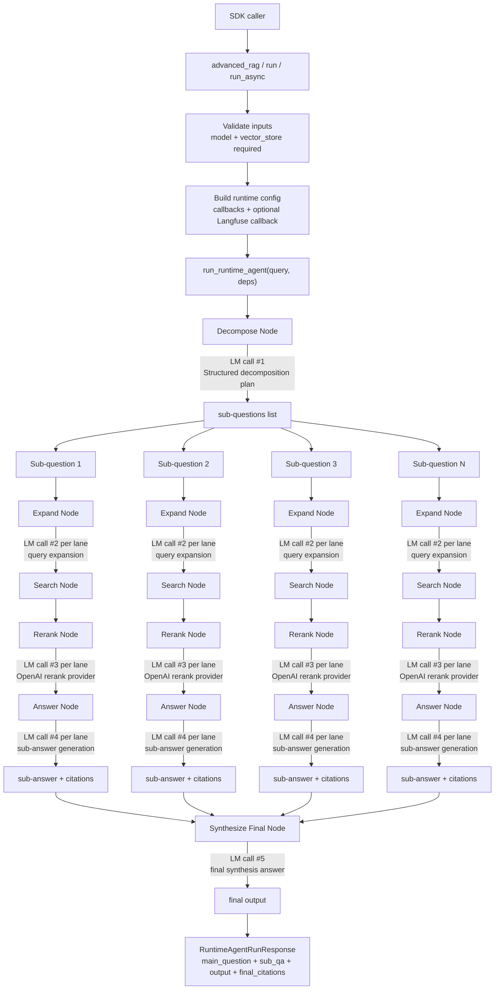

<p align="center">
  
</p>

# agent-search

`agent-search` is a Dockerized RAG application and SDK-style runtime built with FastAPI, React, Postgres, pgvector, and a graph-stage answer pipeline.

## Tech Stack

- Backend: FastAPI + Python + LangChain runtime nodes
- Frontend: React + TypeScript + Vite
- Database: Postgres + pgvector
- Packaging/runtime: Docker Compose
- SDK/deps: `agent-search-core`, `uv` for Python dependency management
- Model/RAG components: chat model + vector store adapter + LLM reranker

## Architecture Decisions

This architecture was inspired by LangChain's write-up on agent search with LangGraph:
- `https://blog.langchain.com/beyond-rag-implementing-agent-search-with-langgraph-for-smarter-knowledge-retrieval/`

Why this approach was effective for this project:
- It maps complex retrieval into explicit node stages with clear dependencies, which makes behavior easier to reason about than a single monolithic RAG prompt.
- It supports fan-out parallel sub-question processing, which improves coverage on ambiguous or multi-entity queries while keeping latency practical.
- It keeps the pipeline extensible: decomposition, expansion, retrieval, reranking, answering, and synthesis can evolve independently without rewriting the whole runtime.

Why this project took inspiration from it:
- The problem profile is similar: broad, ambiguous questions where vanilla single-query retrieval often misses key evidence.
- A graph-style execution model fits the need for traceability, stage-level observability, and controlled fallbacks when a lane has weak evidence.

## Runtime State Graph (Data Flow + LM Calls)



## SDK Logic

Before calling `advanced_rag(...)`, install `agent-search-core`, configure your model provider credentials (for example OpenAI), and provide both:
- a chat model instance
- a vector store adapter (`LangChainVectorStoreAdapter`)

```python
from langchain_openai import ChatOpenAI
from langfuse.langchain import CallbackHandler
from agent_search import advanced_rag
from agent_search.vectorstore.langchain_adapter import LangChainVectorStoreAdapter

vector_store = LangChainVectorStoreAdapter(your_langchain_vector_store)
model = ChatOpenAI(model="gpt-4.1-mini", temperature=0.0)
langfuse_callback = CallbackHandler(
    public_key="...",
    secret_key="...",
    host="https://cloud.langfuse.com",
)
response = advanced_rag(
    "What is pgvector?",
    vector_store=vector_store,
    model=model,
    langfuse_callback=langfuse_callback,
)
print(response.output)
```

Output schema for `advanced_rag(...)`:

```python
RuntimeAgentRunResponse(
  main_question: str,
  sub_qa: list[SubQuestionAnswer],
  output: str,
  final_citations: list[CitationSourceRow],
)
```

## Runtime Node Summary

| Title | Logic |
| --- | --- |
| `Decompose` | **Input -> Output**<br/>- Input: main user question (+ optional initial context)<br/>- Output: list of sub-questions<br/><br/>**How it works**<br/>- Uses a structured-output LangChain LLM (`DecompositionPlan`) in `run_decomposition_node(...)`.<br/>- Normalizes text, removes duplicates, and caps sub-question count.<br/><br/>**Why effective / needed**<br/>- Splits large prompts into focused retrieval tasks.<br/>- Needs: chat model, decomposition config, run metadata. |
| `Expand` | **Input -> Output**<br/>- Input: one sub-question<br/>- Output: expanded query list<br/><br/>**How it works**<br/>- Uses `MultiQueryRetriever.from_llm(...)` in `expand_queries_for_subquestion(...)`.<br/>- Keeps original query, normalizes/truncates, dedupes, and limits by `max_queries`.<br/><br/>**Why effective / needed**<br/>- Increases recall across wording variants.<br/>- Needs: chat model (or API key), query expansion config. |
| `Search` | **Input -> Output**<br/>- Input: sub-question + expanded queries + vector store<br/>- Output: retrieved docs + provenance + citation map<br/><br/>**How it works**<br/>- Runs `search_documents_for_queries(...)` and per-query `search_documents_for_context(...)`.<br/>- Uses `similarity_search_with_relevance_scores(...)` when available; otherwise `similarity_search(...)`.<br/>- Merges duplicate docs by identity and keeps provenance metadata.<br/><br/>**Why effective / needed**<br/>- Gets broad candidate evidence while controlling duplicate chunks.<br/>- Needs: compatible vector store adapter, embeddings-backed index, retrieval limits. |
| `Rerank` | **Input -> Output**<br/>- Input: candidate docs for one sub-question<br/>- Output: reordered docs with updated ranks/citations<br/><br/>**How it works**<br/>- `run_rerank_node(...)` calls `rerank_documents(...)` in reranker service.<br/>- LLM reranker receives query + passages and returns strict JSON ranking/scores.<br/>- Runtime rewrites citation ordering before answer generation.<br/><br/>**Why effective / needed**<br/>- Improves top-context precision after high-recall retrieval.<br/>- Needs: rerank provider/model config and provider credentials (OpenAI in current setup). |
| `Answer` | **Input -> Output**<br/>- Input: sub-question + reranked docs + citation map<br/>- Output: sub-answer + citation indices + answerability status<br/><br/>**How it works**<br/>- `run_answer_node(...)` generates a lane-level answer from reranked evidence.<br/>- Extracts citation markers (`[n]`) and verifies indices exist in citation rows.<br/>- Returns guarded fallback when citation support fails.<br/><br/>**Why effective / needed**<br/>- Keeps answers grounded and traceable to evidence.<br/>- Needs: answer model access and citation rows from earlier stages. |
| `Synthesize Final` | **Input -> Output**<br/>- Input: main question + all sub-answers/artifacts<br/>- Output: final answer<br/><br/>**How it works**<br/>- `run_synthesize_node(...)` combines lane outputs into one response.<br/>- Enforces final citation contract and falls back to citation-valid content if needed.<br/><br/>**Why effective / needed**<br/>- Produces one coherent answer while preserving provenance guarantees.<br/>- Needs: complete sub-qa set, artifacts/citation rows, synthesis model call. |
| `Parallel Lane Execution` | **Input -> Output**<br/>- Input: list of sub-question lane tasks<br/>- Output: completed lane artifacts merged into graph state<br/><br/>**How it works**<br/>- Uses `ThreadPoolExecutor` + `as_completed` in `run_parallel_graph_runner(...)` and timeout-aware helpers.<br/>- Every lane runs the same graph stages independently, then merges at synthesis.<br/><br/>**Why effective / needed**<br/>- Preserves multi-step quality while reducing total wait time compared with strict serial execution.<br/>- Needs: worker limits, timeout/fallback policy, deterministic merge behavior. |
