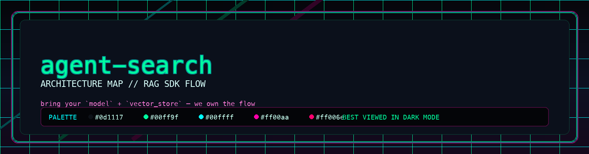
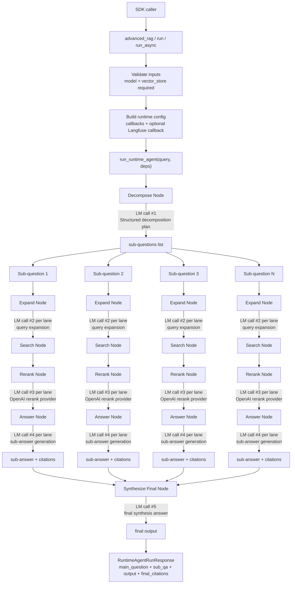

<p align="center">
  
</p>

# agent-search

`agent-search` is an SDK for graph-based, citation-grounded RAG workflows. It turns a model + vector store into a traceable multi-step retrieval and synthesis pipeline.

## Documentation

The consolidated project reference is available at `docs/application-documentation.html`. It is the agent-search-specific HTML source of truth for architecture, concerns, conventions, integrations, stack, structure, testing, runtime flow, and key tradeoffs, including the current no-timeout-guardrails runtime behavior.

## 1.0.0 Release

Integrators adopting the LangGraph-native `1.0.0` release should start with:

- [1.0.0 release notes](docs/releases/1.0.0-langgraph-migration.md)
- [Migration guide](docs/migration-guide.md)
- [Deprecation map](docs/deprecation-map.md)

## How The SDK Is Used

Install dependencies first (`pip`, not “pippin”):

```bash
python -m venv .venv
source .venv/bin/activate
python -m pip install --upgrade pip
pip install agent-search-core langchain-openai langfuse
```

Or with `uv`:

```bash
uv venv
source .venv/bin/activate
uv pip install agent-search-core langchain-openai langfuse
```

Set your model provider key:

```bash
export OPENAI_API_KEY="your_openai_api_key"
```

Then call `advanced_rag(...)` with:
- a chat model instance
- a vector store adapter (`LangChainVectorStoreAdapter`)

```python
from langchain_openai import ChatOpenAI
from langfuse.langchain import CallbackHandler
from agent_search import advanced_rag
from agent_search.vectorstore.langchain_adapter import LangChainVectorStoreAdapter

vector_store = LangChainVectorStoreAdapter(your_langchain_vector_store)
model = ChatOpenAI(model="gpt-4.1-mini", temperature=0.0)
langfuse_callback = CallbackHandler(
    public_key="...",
    secret_key="...",
    host="https://cloud.langfuse.com",
)

response = advanced_rag(
    "What is pgvector?",
    vector_store=vector_store,
    model=model,
    langfuse_callback=langfuse_callback,
)
print(response.output)
```

Response schema from `advanced_rag(...)`:

```python
RuntimeAgentRunResponse(
  main_question: str,
  sub_qa: list[SubQuestionAnswer],
  output: str,
  final_citations: list[CitationSourceRow],
)
```

### Citation Requirements For `final_citations`

For `final_citations` to be populated, both must be true:
- The generated final answer must include citation markers like `[1]`, `[2]`.
- Those indices must map to retrieved/reranked rows from the search pipeline.

PGVector metadata does not need one single mandatory key, but citation quality depends on metadata fields on each stored `Document`.

Recommended metadata per chunk:
- `topic` or `title` or `wiki_page`: used as citation `title`
- `wiki_url` or `source`: used as citation `source`
- `id` (Document id): optional, used as `document_id` and dedupe identity

If `title`/`source` metadata is missing, `final_citations` can still be returned, but those fields may be empty in the citation rows.

Example chunk shape before indexing:

```python
Document(
    page_content=\"pgvector adds vector similarity search to Postgres ...\",
    metadata={
        \"topic\": \"pgvector\",
        \"wiki_url\": \"https://github.com/pgvector/pgvector\",
    },
    id=\"pgvector-intro-001\",
)
```

## Runtime State Graph (Data Flow + LM Calls)


