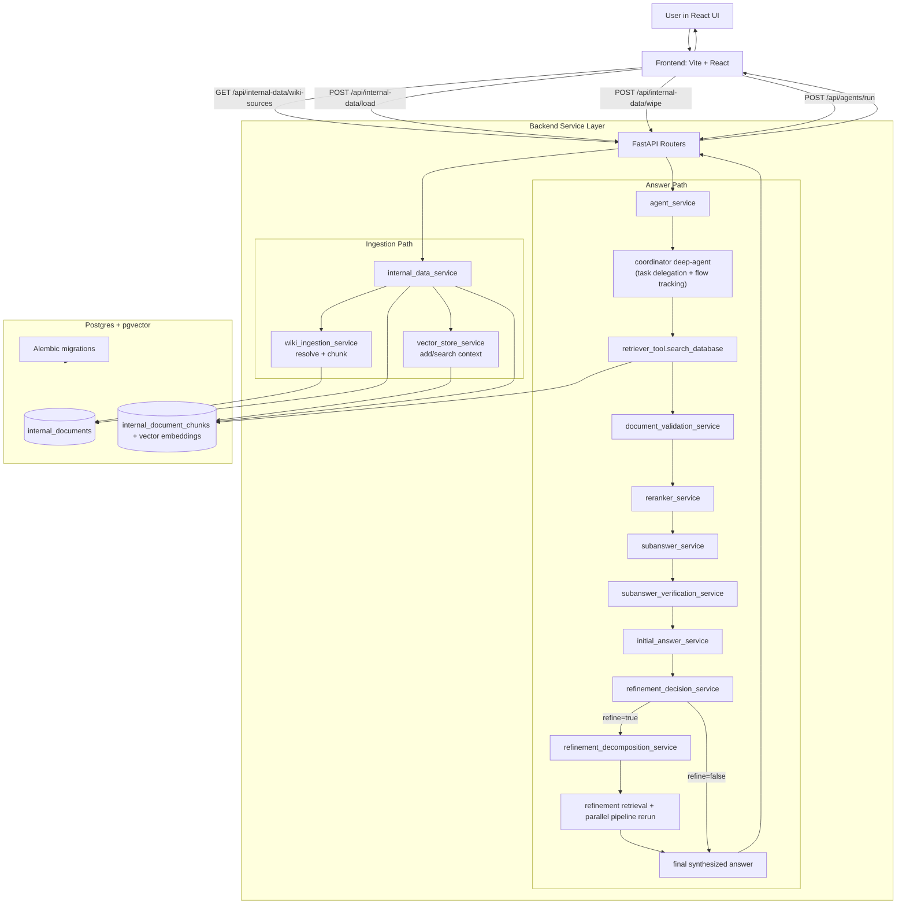

# System Architecture

## Purpose
This system lets a user load curated wiki data into a pgvector-backed store, run a multi-stage retrieval-and-synthesis agent pipeline over that data, and return a final answer with per-subquestion traceability.

## Flow Diagram

## High-Level Flow
1. Frontend loads wiki source options and current loaded-state.
2. User loads a curated wiki source; backend resolves source content, chunks it, embeds it, and stores vectors + source metadata.
3. User submits a query.
4. Backend runs initial context retrieval, then a decomposition-only LLM call, then coordinator-driven subquestion retrieval calls.
5. Per-subquestion pipeline runs in parallel: validate documents, rerank, generate subanswer, verify answer grounding.
6. Backend synthesizes an initial answer from initial context + verified subanswers.
7. Backend decides whether refinement is needed.
8. If needed, backend generates refined subquestions, reruns retrieval/pipeline in parallel, and synthesizes refined final answer.
9. Backend returns `main_question`, `sub_qa[]`, and final `output`; frontend renders final readout.

## Major Components
- Frontend (`src/frontend/src/App.tsx`, `src/frontend/src/utils/api.ts`): UI controls for load/wipe/run, typed API client with shape validation and timeouts.
- FastAPI app/routers (`src/backend/main.py`, `src/backend/routers/*.py`): endpoint exposure and request/response validation.
- Internal data ingestion (`src/backend/services/internal_data_service.py`, `wiki_ingestion_service.py`): curated source resolution, chunking, loading, load-state reporting, data wipe.
- Vector store adapter (`src/backend/services/vector_store_service.py`): PGVector collection lifecycle, document add, context retrieval.
- Runtime orchestrator (`src/backend/services/agent_service.py`): end-to-end execution and branch control.
- Coordinator + retriever (`src/backend/agents/coordinator.py`, `src/backend/tools/retriever_tool.py`): delegation + semantic search.
- Per-subquestion processing services (`document_validation_service.py`, `reranker_service.py`, `subanswer_service.py`, `subanswer_verification_service.py`): retrieval-to-grounded-answer transforms.
- Synthesis + refinement (`initial_answer_service.py`, `refinement_decision_service.py`, `refinement_decomposition_service.py`): answer assembly and fallback/refinement loop.
- Persistence (`src/backend/models.py`, `src/backend/alembic/versions/001_add_internal_documents_tables.py`): relational + vector schema.

## End-to-End Data Flow
### 1) Ingestion Pipeline (write path)
- Inputs:
  - `POST /api/internal-data/load` with `{ source_type: "wiki", wiki: { source_id } }`.
- Transformations:
  - Validate curated source ID.
  - Pull one wiki article and normalize metadata.
  - Split into chunks.
  - Generate embeddings via configured embedding model.
  - Insert original docs into `internal_documents` and chunk vectors into PGVector collection.
- Outputs:
  - `InternalDataLoadResponse` with `documents_loaded` and `chunks_created`.
- Data movement:
  - Frontend -> FastAPI router -> `internal_data_service` -> `wiki_ingestion_service` + `vector_store_service` -> Postgres/pgvector.

### 2) Query/Answer Pipeline (read + compute path)
- Inputs:
  - `POST /api/agents/run` with `{ query }`.
- Transformations:
  - Initial retrieval (`k`, optional threshold) becomes structured context for later synthesis.
  - Decomposition-only LLM call produces initial subquestions (question-only input).
  - Coordinator delegates retrieval to the subagent for each provided subquestion.
  - Callback capture maps each retrieval call to subquestion artifacts.
  - Parallel per-subquestion pipeline applies:
    - validation filters,
    - lexical reranking,
    - subanswer generation,
    - evidence-overlap verification.
  - Initial synthesis combines initial context + subanswer states.
  - Refinement decision checks answer sufficiency and answerable ratio.
  - Optional refinement loop generates targeted subquestions and reruns parallel path.
- Outputs:
  - `RuntimeAgentRunResponse { main_question, sub_qa[], output }`.
- Data movement:
  - Frontend -> FastAPI router -> `agent_service` -> vector store/coordinator/subservices -> final response -> Frontend render.

### 3) Control and observability flow
- Callback handlers capture `search_database` input/output pairs for deterministic `sub_qa` extraction.
- Logging tracks each stage and branch (`refinement_needed`, per-subquestion verification reasons, final output length).
- Coordinator keeps internal flow state in deep-agents virtual filesystem (`/runtime/coordinator_flow.md`) plus todo updates.
- Coordinator runtime also uses a LangGraph in-memory checkpointer; each `/api/agents/run` invocation is assigned a fresh UUID `thread_id` so checkpoints are isolated per run.
- Optional Langfuse callback is attached per run when `LANGFUSE_ENABLED=true` with valid credentials and flushed at invoke completion.

## Key Interfaces and APIs
- Backend HTTP APIs:
  - `GET /api/health`
  - `GET /api/internal-data/wiki-sources`
  - `POST /api/internal-data/load`
  - `POST /api/internal-data/wipe`
  - `POST /api/agents/run`
- Core backend contracts:
  - `RuntimeAgentRunRequest.query`
  - `RuntimeAgentRunResponse.main_question|sub_qa|output`
  - `SubQuestionAnswer` includes retrieval input, generated answer, and verification fields.
- Database interfaces:
  - `internal_documents` for source-level records.
  - `internal_document_chunks` with `embedding Vector(1536)` and metadata.

## Section Connectivity (1-14)
- Sections 1-3 establish coordinator flow tracking + decomposition-only handoff.
- Sections 4-9 define one subquestion processing lane from query expansion through verification.
- Section 10 parallelizes that lane across all decomposed subquestions.
- Section 11 synthesizes initial answer from lane outputs + initial context.
- Sections 12-14 decide refinement, generate refined subquestions, rerun the lane, and replace final output when refinement is used.

## Deployment and Runtime Boundaries
- `frontend` container: React/Vite UI on `:5173`.
- `backend` container: FastAPI + agent/services on `:8000`; runs Alembic migration at startup.
- `db` container: Postgres 16 with pgvector extension and persistent `pg_data` volume.
- Optional `chrome` container for remote debugging on `:9222`.
- Cross-boundary calls:
  - Browser -> frontend dev server.
  - Frontend -> backend HTTP API.
  - Backend -> Postgres/pgvector.
  - Backend -> external LLM/Wikipedia services (when configured).

## Tradeoffs
- Agent-driven orchestration vs deterministic pipeline-only orchestration:
  - Choice: keep deep-agent coordinator for delegation, then deterministic Python services for post-retrieval stages.
  - Pros: flexible decomposition quality + predictable downstream transforms.
  - Cons: mixed control model increases tracing complexity.
- String-formatted retrieved-doc payloads vs strict typed objects across all stages:
  - Choice: use line-based text format between some stages for compatibility with tool outputs.
  - Pros: easy to log and display directly in UI.
  - Cons: parsing fragility and extra conversion overhead.
- Rule-based validation/reranking/verification vs LLM-only scoring:
  - Choice: lightweight deterministic rules for filtering, reranking, and answerability checks.
  - Pros: low latency/cost, reproducible behavior.
  - Cons: weaker semantic nuance than model-based ranking/verifiers.
- Parallel thread pool per subquestion vs sequential processing:
  - Choice: `ThreadPoolExecutor` for per-subquestion concurrency.
  - Pros: better throughput for multi-subquestion runs.
  - Cons: more complex error handling and log interleaving.
- Refinement-on-threshold policy vs always-refine or never-refine:
  - Choice: conditional refinement based on insufficiency patterns and answerable ratio.
  - Pros: avoids unnecessary second-pass compute when first pass is adequate.
  - Cons: threshold tuning can cause false positives/negatives.
- Fallback-first reliability vs strict dependency on external APIs:
  - Choice: fallback responses when OpenAI key/service is unavailable.
  - Pros: system still returns usable output under degraded conditions.
  - Cons: answer quality drops versus LLM-backed synthesis/subanswers.
