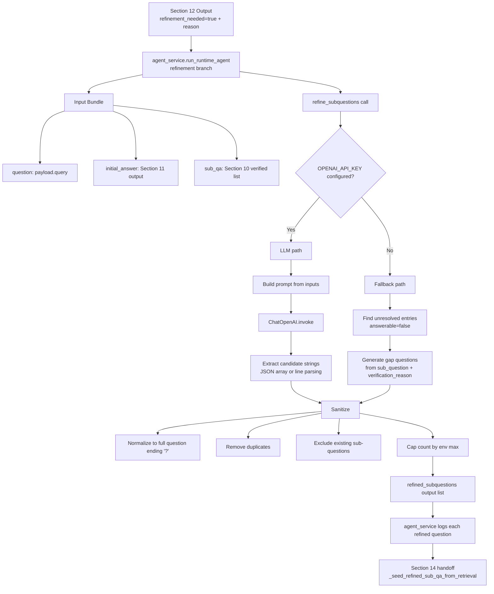

# Section 13 Architecture: Refinement Decomposition

## Purpose
Generate a targeted second-pass sub-question list when Section 12 marks the initial answer as incomplete. This stage does not retrieve documents or synthesize a final answer. It only transforms existing run artifacts into refined sub-questions for Section 14.

## Components
- Refinement decomposition service:
`src/backend/services/refinement_decomposition_service.py`
- Runtime orchestration branch and Section 14 handoff:
`src/backend/services/agent_service.py`
- Shared per-subquestion schema contract (`SubQuestionAnswer`):
`src/backend/schemas/agent.py`
- Section 13 behavior tests:
`src/backend/tests/services/test_refinement_decomposition_service.py`,
`src/backend/tests/services/test_agent_service.py`

## Flow Diagram

## Data Flow
Inputs:
- `question: str` from `RuntimeAgentRunRequest.query`.
- `initial_answer: str` produced in Section 11.
- `sub_qa: list[SubQuestionAnswer]` from Section 10.
- Critical `sub_qa` fields used here are `sub_question`, `answerable`, and `verification_reason`.

Transformations:
1. Section 12 emits `refinement_needed=True`, so `run_runtime_agent(...)` invokes `refine_subquestions(...)`.
2. `refine_subquestions(...)` serializes `sub_qa` using `_format_sub_qa(...)` so the model/fallback can reason over gaps.
3. Candidate generation happens in one of two paths:
LLM path: Prompted model returns candidate sub-question strings.
Fallback path: Deterministic question generation from unresolved items and verification reasons.
4. `_sanitize_refined_subquestions(...)` applies the shared output contract:
normalize text to a complete `?`-terminated question; drop blank entries; dedupe case-insensitively; reject candidates that match existing `sub_qa.sub_question`; truncate to `REFINEMENT_DECOMPOSITION_MAX_SUBQUESTIONS`.
5. Sanitized `list[str]` returns to `agent_service`, where each question is logged and passed to Section 14 retrieval seeding.

Outputs:
- Primary output: `refined_subquestions: list[str]`.
- Secondary output: operational logs (`RefinedSubQuestion[n]=...`, count, chosen path LLM/fallback).

Data movement and boundaries:
- In-memory only for section logic; no DB writes.
- Optional external boundary: OpenAI call through `ChatOpenAI` on the LLM path.
- Stable fallback keeps behavior available when API key is missing or model call fails.

## Key Interfaces / APIs
- Main Section 13 interface:
`refine_subquestions(*, question: str, initial_answer: str, sub_qa: list[SubQuestionAnswer]) -> list[str]`
- Sanitization contract helper:
`_sanitize_refined_subquestions(*, candidates: list[str], existing_subquestions: list[str]) -> list[str]`
- Agent orchestration call site:
`run_runtime_agent(payload: RuntimeAgentRunRequest, db: Session) -> RuntimeAgentRunResponse`
- Section 14 handoff interface (adjacent consumer):
`_seed_refined_sub_qa_from_retrieval(*, vector_store: Any, refined_subquestions: list[str]) -> list[SubQuestionAnswer]`

## How It Fits Adjacent Sections
- Upstream dependency (Section 12):
Section 12 provides the gate signal (`refinement_needed`) and reason. Section 13 runs only on the `True` branch.

- Downstream dependency (Section 14):
Section 13 emits only refined sub-question strings. Section 14 consumes this list, performs retrieval seeding, runs the per-subquestion pipeline again, and synthesizes the refined final answer.

- Interaction with prior artifacts:
Section 13 reuses Section 10 verification metadata and Section 11 answer text as evidence of gaps, instead of starting from raw query only.

## Tradeoffs
1. LLM-first decomposition with deterministic fallback vs fallback-only
- Chosen: LLM-first with fallback.
- Pros: better semantic gap targeting when model is available; resilient offline/failure behavior.
- Cons: extra latency/cost and nondeterminism on LLM path.
- Rejected alternative: fallback-only.
- Why rejected: lower quality and weaker adaptation to nuanced missing coverage.

2. Strict sanitization contract vs permissive passthrough
- Chosen: normalize, dedupe, exclude already-asked sub-questions, enforce max.
- Pros: protects Section 14 from duplicate/noisy inputs and unbounded fan-out.
- Cons: aggressive filtering can discard potentially useful variants.
- Rejected alternative: trust raw LLM output.
- Why rejected: unstable downstream behavior and larger retrieval cost.

3. Excluding existing sub-questions vs allowing retries of same question
- Chosen: exclude exact normalized repeats.
- Pros: pushes refinement toward net-new evidence gaps and reduces repeated work.
- Cons: blocks intentional retries where improved retrieval settings might now succeed.
- Rejected alternative: allow repeated questions with retry counters.
- Why rejected: added state management complexity for this iteration.

4. Environment-driven max refined question count vs fixed value in code
- Chosen: `REFINEMENT_DECOMPOSITION_MAX_SUBQUESTIONS` from env.
- Pros: lets operators tune quality/cost tradeoff without code change.
- Cons: environment drift can produce inconsistent behavior across deployments.
- Rejected alternative: hardcoded count.
- Why rejected: less operational flexibility while tuning refinement breadth.

5. Free-text prompt context (`_format_sub_qa`) vs structured typed payload to model
- Chosen: compact text serialization in prompt.
- Pros: simple implementation and no additional schema translation layer.
- Cons: model interpretation can vary; less explicit than strict JSON schema prompting.
- Rejected alternative: fully structured JSON schema output+input contract.
- Why rejected: higher implementation overhead for modest immediate gain.
