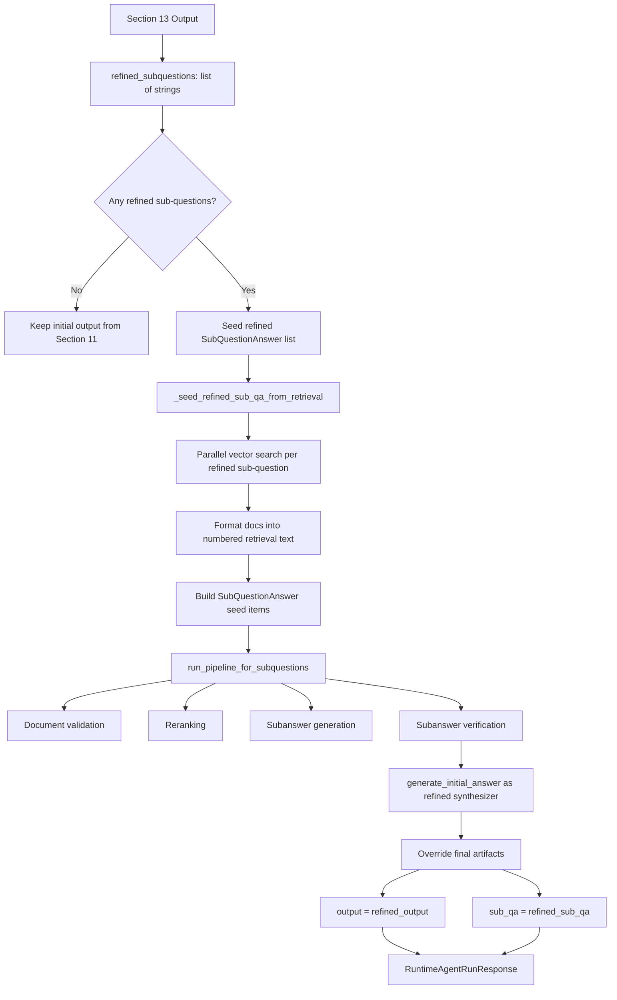

# Section 14 Architecture: Refinement Answer Path

## Purpose
Run a second-pass answer pipeline when Section 12 and Section 13 indicate refinement is needed. This section takes refined sub-questions, retrieves and processes evidence for each one in parallel, and replaces the initial answer with a refined synthesized answer.

## Components
- Runtime orchestration and refinement branch:
`src/backend/services/agent_service.py`
- Shared per-subquestion pipeline reused from Sections 4-9:
`run_pipeline_for_subquestions(...)` and `_run_pipeline_for_single_subquestion(...)` in `src/backend/services/agent_service.py`
- Refined retrieval seeding:
`_seed_refined_sub_qa_from_retrieval(...)` and `_format_retrieved_documents_for_pipeline(...)` in `src/backend/services/agent_service.py`
- Final synthesis service reused from Section 11:
`src/backend/services/initial_answer_service.py`
- Response contract carrying final output and per-subquestion artifacts:
`src/backend/schemas/agent.py`
- Tests covering refinement path and retrieval seeding:
`src/backend/tests/services/test_agent_service.py`

## Flow Diagram

## Data Flow
Inputs:
- `refined_subquestions: list[str]` from Section 13 (`refine_subquestions(...)`).
- Shared runtime dependencies already initialized earlier in `run_runtime_agent(...)`:
`vector_store`, `payload.query` (main question), and `initial_search_context`.
- Tuning values from env:
`SUBQUESTION_PIPELINE_MAX_WORKERS` and `REFINEMENT_RETRIEVAL_K`.

Transformations:
1. `run_runtime_agent(...)` enters the refinement branch only when `should_refine(...)` returns `refinement_needed=True`.
2. `_seed_refined_sub_qa_from_retrieval(...)` fans out refined sub-questions across a thread pool.
3. For each refined sub-question, `search_documents_for_context(...)` retrieves top-`k` documents from pgvector-backed vector store.
4. `_format_retrieved_documents_for_pipeline(...)` converts retrieved docs to parseable ranked lines (`1. title=... source=... content=...`), matching downstream expectations from earlier sections.
5. Seeded `SubQuestionAnswer` records are created with:
`sub_question`, retrieval text in `sub_answer`, and serialized `tool_call_input` (`{"query": ..., "limit": ...}`).
6. `run_pipeline_for_subquestions(...)` reuses Section 10 parallel execution to apply validation, reranking, generation, and verification for each refined item.
7. `generate_initial_answer(...)` synthesizes a refined final answer using:
`main_question`, original `initial_search_context`, and refined `sub_qa`.
8. Final response artifacts are replaced:
`output = refined_output` and `sub_qa = refined_sub_qa`.

Outputs:
- Primary output: `RuntimeAgentRunResponse.output` containing the refined synthesized answer.
- Supporting output: `RuntimeAgentRunResponse.sub_qa` containing refined per-subquestion results and verification metadata.
- Operational telemetry: refinement retrieval start/complete logs, per-item retrieval logs, and refinement completion logs.

Data movement and boundaries:
- In-process memory: orchestration, transformations, and object mutation.
- External read boundary: vector search queries against DB/vector store (no writes in this section).
- Optional external model boundary: synthesis call in `generate_initial_answer(...)` (provider/model configured elsewhere).
- API boundary: refined artifacts returned through `RuntimeAgentRunResponse`.

## Key Interfaces / APIs
- Refinement branch entrypoint:
`run_runtime_agent(payload: RuntimeAgentRunRequest, db: Session) -> RuntimeAgentRunResponse`
- Retrieval seeding interface:
`_seed_refined_sub_qa_from_retrieval(*, vector_store: Any, refined_subquestions: list[str]) -> list[SubQuestionAnswer]`
- Shared parallel pipeline interface:
`run_pipeline_for_subquestions(sub_qa: list[SubQuestionAnswer]) -> list[SubQuestionAnswer]`
- Final synthesis interface:
`generate_initial_answer(*, main_question: str, initial_search_context: list[dict[str, Any]], sub_qa: list[SubQuestionAnswer]) -> str`
- Response schema:
`RuntimeAgentRunResponse(main_question: str, sub_qa: list[SubQuestionAnswer], output: str)`

## How It Fits Adjacent Sections
- Upstream (Section 13):
Section 13 produces refined sub-question strings only. Section 14 is the first stage that retrieves new evidence and executes the full per-subquestion processing loop for those strings.

- Downstream (response finalization):
Section 14 is terminal on the refinement path. When it executes with non-empty refined inputs, its synthesized answer becomes the final `response.output`.

- Relationship to Sections 4-11:
Section 14 intentionally reuses the same subquestion pipeline and synthesis logic as the initial path, but with a different sub-question set and newly seeded retrieval payloads.

## Tradeoffs
1. Reusing the same pipeline for refined sub-questions vs building a separate refinement-specific pipeline
- Chosen: reuse `run_pipeline_for_subquestions(...)` and existing services.
- Pros: consistent behavior, less duplicate logic, lower maintenance risk.
- Cons: refinement stage inherits any limitations of the original pipeline and may do unnecessary work for narrow follow-up gaps.
- Rejected alternative: custom lightweight refinement pipeline.
- Why rejected: higher implementation complexity and risk of divergence from baseline quality checks.

2. Retrieval reseeding from vector store vs reusing initial-path retrieval artifacts
- Chosen: fresh retrieval for each refined sub-question.
- Pros: aligns evidence to new information gaps; better chance of finding missing support.
- Cons: added latency and query load on vector store.
- Rejected alternative: reuse earlier retrieved docs with local filtering.
- Why rejected: stale or misaligned evidence when refined questions differ semantically from first-pass questions.

3. Parallel refinement processing vs sequential execution
- Chosen: thread-pooled parallelism with bounded workers.
- Pros: lower wall-clock latency for multi-question refinement runs.
- Cons: concurrency increases operational complexity and can raise burst load against retrieval/model services.
- Rejected alternative: strict sequential processing.
- Why rejected: slower end-user responses for little quality benefit.

4. Replacing final output with refined answer vs returning both initial and refined answers in response contract
- Chosen: overwrite `output` and `sub_qa` with refined artifacts when refinement succeeds.
- Pros: simple client contract; single authoritative answer.
- Cons: client loses direct visibility into initial answer unless separately logged or extended schema is added later.
- Rejected alternative: dual-answer response fields (`initial_answer`, `refined_answer`).
- Why rejected: larger API surface and migration overhead for current iteration.

5. Fixed-format retrieval text lines vs passing structured document objects through pipeline stages
- Chosen: normalized text formatting (`1. title=... source=... content=...`) before entering shared pipeline.
- Pros: compatible with existing parsers/validators/rerankers; minimal refactor.
- Cons: lossy compared with typed objects and more fragile string parsing assumptions.
- Rejected alternative: fully typed retrieval payload contract across all stages.
- Why rejected: broader cross-section refactor beyond this section scope.
