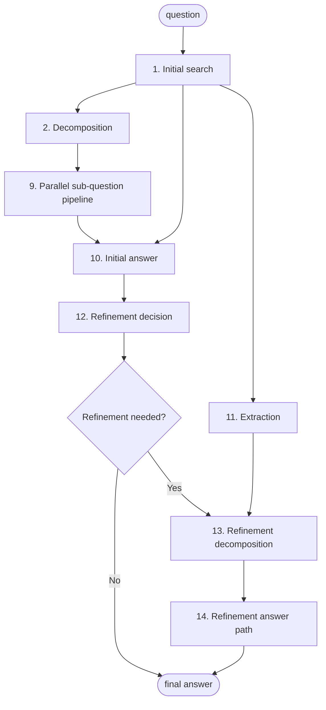

# Agent-Search System Flow

How the implementation plan sections connect at runtime. Section numbers match `IMPLEMENTATION_PLAN.md`.

---

## High-level flow

- **Section 9** runs the per-subquestion pipeline (steps 3–8) for all sub-questions in parallel.
- **Section 13** uses: initial answer (10), SubQuestionAnswer list (9), and ExtractionResult (11). **Section 14** reuses the same pipeline (3–8) for refined sub-questions.

---

## Per-subquestion pipeline (Sections 3–8)

Same sequence runs for each **initial** sub-question (Section 9) and each **refined** sub-question (Section 14).

---

## Data flow summary

| Output | Produced by | Consumed by |
|--------|-------------|-------------|
| Initial search context | 1 | 2, 10, 11 |
| Sub-questions | 2 | 9 |
| SubQuestionAnswer list | 9 (3–8) | 10, 12, 13 |
| ExtractionResult | 11 | 13 |
| Initial answer | 10 | 12, 13 |
| refinement_needed | 12 | 13 (if true) |
| Refined sub-questions | 13 | 14 |
| Final answer | 10 (no refinement) or 14 (refinement) | response |

---

## Parallelism

- **Section 9:** All sub-questions run the pipeline (3→8) in parallel.
- **Section 11:** Extraction can run in parallel with the sub-question pipeline (2→9); both only need Section 1.
- **Section 14:** Refined sub-questions again run the same pipeline in parallel.
